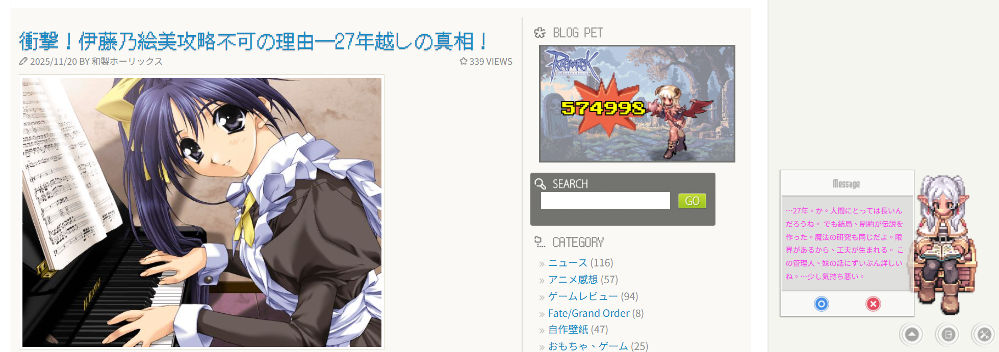

# MP Ukagaka

A WordPress plugin for creating interactive ukagaka (伺か) characters with AI-powered features.

🌍 **Other Languages**: [繁體中文](README_zh-TW.md) | [日本語](README_ja.md)

## 📢 Preface (Please Read)

This plugin is an extensively expanded version based on the original WordPress plugin "MP Ukagaka" released by Ariagle over 10 years ago.

> ⚠️ **Important Notice**: Approximately 90% of this plugin's code was developed using AI-assisted development (Vibe Coding). Although it has undergone countless rounds of debugging and improvements, there may still be unknown bugs or imperfect code structures. Please understand this risk before use.

📺 **Demo Site**: [https://www.moelog.com](https://www.moelog.com/)

### About Character Personality Creation

While this plugin provides the **Create New Character Personality** feature (see [GHOST_CREATE_GUIDE.md](docs-en/GHOST_CREATE_GUIDE.md)), development efforts have primarily focused on the default character "Frieren". Therefore, this feature has not been fully tested. Your understanding is appreciated.

If you simply want to use the default character "Frieren", basic dialogues are built-in and ready to use out of the box. For richer, more interactive conversations, we recommend configuring an AI model API Key. Additionally, the character memory configuration files (loading sequence: [personality.md](ghost/Frieren/personality.md), [instructions.md](ghost/Frieren/instructions.md), and then [system_prompt.md](ghost/Frieren/system_prompt.md), containing memories from anime Season 1) are also built-in. You can configure your **Admin full nickname**, **Admin short name**, and **Admin birthday** (MM-DD format, e.g., `10-18`) directly in **Settings → MP Ukagaka → General Settings**. The personality files use `{{admin_nickname}}`, `{{admin_name}}`, and `{{admin_birthday}}` as placeholders — these are automatically filled in from your backend settings at runtime, so you no longer need to manually edit the personality files or `calendar.json`. The character will also celebrate your birthday automatically based on this setting.

### AI Model Recommendations

This plugin supports multiple AI providers including Gemini, OpenAI, Claude, and Ollama. Based on testing, **GPT-4o Mini** offers an excellent balance between dialogue generation quality and API costs, making it a highly recommended choice.

## 📸 Screenshot

_Frieren character displaying AI-generated dialogue based on article content_

> 💡 **More Screenshots**:
>
> - `screenshot2.PNG` - General Settings & LLM Settings pages
> - `screenshot3.PNG` - Interactive Chat Mode demo (v2.3.0 feature)

## ✨ Core Features

- **Multiple Characters**: Create and manage multiple ukagaka characters
- **AI Context Awareness**: Intelligent responses using Gemini, OpenAI, Claude, or Ollama
- **Interactive Chat Mode**: Real-time conversations with visitors, including SSE streaming responses
- **External Dialog Files**: Support for TXT and JSON format dialogues
- **Canvas Animation**: Single image or multi-frame animation support
- **Multi-Language**: English, Traditional Chinese, and Japanese
- **Security First**: API key encryption, CSRF protection, XSS prevention

## 🚀 Quick Start

### Installation

1. Download or clone this repository to `wp-content/plugins/`
2. Activate the plugin in WordPress Admin → Plugins
3. Go to **Settings → MP Ukagaka**

### Basic Setup

1. **General Settings**: Choose default character and configure display settings
2. **Create Character**: Add character with image URL and dialogues
3. **Dialog Files**: Dialogues are automatically saved to `dialogs/` folder

### Enable AI Features (Optional)

**LLM Settings**:

- Choose provider: Ollama (free), Gemini, OpenAI, or Claude
- Enter API key (automatically encrypted) or configure Ollama endpoint
- Enable "Replace Built-in Dialogues"

**AI Settings**:

- Enable "Page Awareness"
- Set trigger probability (10-30% recommended for cost control)
- Customize character personality in System Prompt

**Chat Mode**:

- Enable "Interactive Chat Mode" in General Settings
- "Change Ukagaka" button becomes a chat interface

## 🤖 AI Providers

| Provider   | Cost     | Setup                                                                     |
| ---------- | -------- | ------------------------------------------------------------------------- |
| **Ollama** | Free     | Install locally or connect to remote server                               |
| **Gemini** | Paid API | Get key from [Google AI Studio](https://makersuite.google.com/app/apikey) |
| **OpenAI** | Paid API | Get key from [OpenAI Platform](https://platform.openai.com/api-keys)      |
| **Claude** | Paid API | Get key from [Anthropic Console](https://console.anthropic.com/)          |

## 📚 Documentation

For detailed information, please refer to:

- **[User Guide](docs-en/USER_GUIDE.md)** - Complete setup and configuration guide
- **[Developer Guide](docs-en/DEVELOPER_GUIDE.md)** - Architecture and development info
- **[API Reference](docs-en/API_REFERENCE.md)** - Function and hook reference
- **[Changelog](docs-en/CHANGELOG.md)** - Version history

## 🎉 What's New in v2.32.0

**Gift reactions with something to say** (v2.32.0): v2.31.0 stopped the character inventing your motives, but in the same pass it left her with nothing to say about what she was holding — the grimoire would not name what kind of book it was, and food drew a bare thank-you. The cause was a rule that handed the model a decision instead of a default: whether to open someone else's gift was left for it to adjudicate, and the safe answer is always no. Tasting food and looking inside an openable gift are now plainly permitted, while telling her not to eat or not to open something still binds, and the reaction lines carry hooks — the item, a memory, what she plans to do with it — rather than instructions to say thanks. She may also leave out whatever does not fit the conversation and fill in small details herself, while your motive, where you got it and what you knew stay yours alone. Frieren gains ハンバーグ, a warrior's dish from Eisen's homeland, and the pudding gains seven appearance variants so its scene is no longer identical every time.

**Gift reactions that listen** (v2.31.0): Handing the character a gift is now part of the conversation instead of an isolated event. The gift endpoint had been receiving and storing the chat history without ever passing it to the model, so saying "this is a thank-you gift" a turn earlier could not affect the reply; gifts now use the same 20-message window as normal chat. The prompt no longer lets a randomly drawn stage direction outrank what you actually said — each source of information has a defined scope, so the character stops asking why you chose something you had just said you knew nothing about, stops tasting food you warned her about, and stops treating a hidden random detail as something you must have known. Repeat gifts also no longer replay word for word.

**Frontend CSS modernization** (v2.30.0): The frontend stylesheet was rebuilt around internal custom properties, cutting `!important` from 81 to 4 — each survivor now carries a written reason — and removing dead rules that no longer matched anything. Three user-facing improvements came with it: the chat log no longer scrolls the page behind it when you reach the end, the dock buttons show a keyboard focus indicator again, and `prefers-reduced-motion` is respected. This is deliberately a refactor with no layout change: screenshots across five scenes are byte-identical before and after, verified by a new Playwright regression harness. Note that the `--mpu-internal-*` properties are internal implementation, not a theming API.

**Earlier releases**: gift message attachment (v2.29.0), per-item variant substitution for gift reactions (v2.28.0), chat integrity session follow-up (v2.27.7), review follow-up hardening (v2.27.6), housekeeping and uninstall cleanup (v2.27.5), checksum window filtering (v2.27.4), gift reliability & checksum consolidation (v2.27.3), the 🎁 Gift / Feeding system (v2.27.0), daytime nap (v2.26.0), the frontend modular split (v2.25.7), authenticated AES-256-GCM key encryption (v2.25.6), and inline emotion tags (v2.25.0), among others.

[View Full Changelog](docs-en/CHANGELOG.md)

## ❓ Common Questions

**Why isn't AI triggering?**

- Check API key is valid
- Verify page matches trigger conditions (e.g., `is_single`)
- Ensure probability is set (try 100% for testing)
- Check content length (\>300 characters required)

**How to control API costs?**

- Set probability to 10-20%
- Use cheaper models (gemini-2.5-flash, gpt-4o-mini)
- Limit trigger pages to `is_single`

**LLM connection failed?**

- For Ollama: Ensure service is running on port 11434
- For remote: Check Cloudflare Tunnel or network connection
- Test connection using the test button in settings

[More FAQ in User Guide](docs-en/USER_GUIDE.md#faq)

## 🔒 Security Features

- **API Key Encryption**: AES-256-GCM encryption for all API keys
- **CSRF Protection**: WordPress nonce verification for all forms
- **XSS Prevention**: Input/output sanitization using WordPress core functions
- **Secure File Operations**: Path validation and WordPress Filesystem API

## 💬 Support

- Visit [MOELOG.COM](https://www.moelog.com/)
- Check [User Guide](docs-en/USER_GUIDE.md) and [FAQ](docs-en/USER_GUIDE.md#faq)
- Open an issue on GitHub

## 👥 Credits

- **Original Author**: Ariagle
- **Maintainer**: Horlicks ([MOELOG.COM](https://www.moelog.com/))
- **Inspired by**: Classic MP Ukagaka plugin / 伺か (Ukagaka)

## 📄 License

Based on the original MP Ukagaka plugin. Please refer to the original plugin's license terms.

---

**Made with ❤ for the WordPress community**
