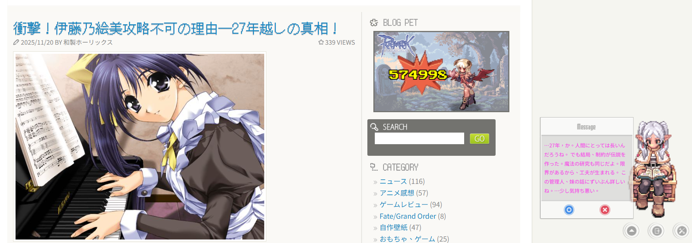

# MP Ukagaka

A WordPress plugin for creating interactive ukagaka (伺か) characters with AI-powered features.

🌍 **Other Languages**: [繁體中文](README_zh-TW.md) | [日本語](README_ja.md)

## 📢 Preface (Please Read)

This plugin is an extensively expanded version based on the original WordPress plugin "MP Ukagaka" released by Ariagle over 10 years ago.

> ⚠️ **Important Notice**: Approximately 90% of this plugin's code was developed using AI-assisted development (Vibe Coding). Although it has undergone countless rounds of debugging and improvements, there may still be unknown bugs or imperfect code structures. Please understand this risk before use.

📺 **Demo Site**: [https://www.moelog.com](https://www.moelog.com/)

### About Character Personality Creation

While this plugin provides the **Create New Character Personality** feature (see [GHOST_CREATE_GUIDE.md](docs-en/GHOST_CREATE_GUIDE.md)), development efforts have primarily focused on the default character "Frieren". Therefore, this feature has not been fully tested. Your understanding is appreciated.

If you simply want to use the default character "Frieren", basic dialogues are built-in and ready to use out of the box. For richer, more interactive conversations, we recommend configuring an AI model API Key. Additionally, the character memory configuration files ([personality.md](ghost/Frieren/personality.md) and [instructions.md](ghost/Frieren/instructions.md), containing memories from anime Season 1) are also built-in. You can configure your **Admin full nickname**, **Admin short name**, and **Admin birthday** (MM-DD format, e.g., `10-18`) directly in **Settings → MP Ukagaka → General Settings**. The personality files use `{{admin_nickname}}`, `{{admin_name}}`, and `{{admin_birthday}}` as placeholders — these are automatically filled in from your backend settings at runtime, so you no longer need to manually edit the personality files or `calendar.json`. The character will also celebrate your birthday automatically based on this setting.

### AI Model Recommendations

This plugin supports multiple AI providers including Gemini, OpenAI, Claude, and Ollama. Based on testing, **GPT-4o Mini** offers an excellent balance between dialogue generation quality and API costs, making it a highly recommended choice.

## 📸 Screenshot

_Frieren character displaying AI-generated dialogue based on article content_

> 💡 **More Screenshots**:
>
> - `screenshot2.PNG` - General Settings page
> - `screenshot3.PNG` - Interactive Chat Mode
> - `screenshot4.PNG` - LLM Settings page
> - `screenshot7.PNG` - Abilities: reporting bot-blocker statistics
> - `screenshot8.PNG` - Gift / feeding picker
>
> Project page: <https://horlicks-p.github.io/mp-ukagaka/>

## ✨ Core Features

- **Multiple Characters**: Create and manage multiple ukagaka characters
- **AI Context Awareness**: Intelligent responses using Gemini, OpenAI, Claude, or Ollama
- **Interactive Chat Mode**: Real-time conversations with visitors, including SSE streaming responses
- **Gifts & Feeding**: Visitors can hand the character food or gifts in Chat Mode, with a message attached
- **Sleep & Waking**: Night sleep, oversleeping and daytime naps, with a wake-up animation when you talk to her
- **Abilities**: Ask in chat for popular posts or bot-blocker stats, or have the character ban an IP (admin)
- **AI Diary, Weather & Calendar**: Occasional diary posts, local weather and seasonal events woven into dialogue
- **External Dialog Files**: Support for TXT and JSON format dialogues
- **Canvas Animation**: Single image or multi-frame animation support
- **Multi-Language**: English, Traditional Chinese, and Japanese
- **Security First**: API key encryption, CSRF protection, XSS prevention

## 🚀 Quick Start

### Installation

1. Download `mp-ukagaka.zip` from the [latest release](https://github.com/Horlicks-p/mp-ukagaka/releases/latest) (not GitHub's "Source code" archive, whose folder name differs)
2. In WordPress Admin → **Plugins → Add New → Upload Plugin**, upload the ZIP and activate it
3. Go to **Settings → MP Ukagaka**

Later versions show up as normal plugin updates in the WordPress admin.

### Basic Setup

1. **General Settings**: Choose default character and configure display settings
2. **Create Character**: Add character with image URL and dialogues
3. **Dialog Files**: Dialogues are automatically saved to `dialogs/` folder

### Enable AI Features (Optional)

**LLM Settings**:

- Choose provider: Ollama (free), Gemini, OpenAI, or Claude
- Enter API key (automatically encrypted) or configure Ollama endpoint
- Check "Enable context awareness" to turn on AI comments and the first-visit greeting
- Optionally check "Use LLM to replace built-in dialogues" for AI-generated auto talk
- Check "Enable interactive chat feature" for Chat Mode — the dock's change-character button becomes a chat button

**AI Settings**:

- Set trigger probability (10-30% recommended for cost control) and trigger pages
- The character's personality comes from its own `personality.md` / `instructions.md`; the System Prompt field here is only a fallback for characters without them

## 🤖 AI Providers

| Provider   | Cost     | Setup                                                                     |
| ---------- | -------- | ------------------------------------------------------------------------- |
| **Ollama** | Free     | Install locally or connect to remote server                               |
| **Gemini** | Paid API | Get key from [Google AI Studio](https://makersuite.google.com/app/apikey) |
| **OpenAI** | Paid API | Get key from [OpenAI Platform](https://platform.openai.com/api-keys)      |
| **Claude** | Paid API | Get key from [Anthropic Console](https://console.anthropic.com/)          |

## 📚 Documentation

For detailed information, please refer to:

- **[User Guide](docs-en/USER_GUIDE.md)** - Complete setup and configuration guide
- **[Developer Guide](docs-en/DEVELOPER_GUIDE.md)** - Architecture and development info
- **[API Reference](docs-en/API_REFERENCE.md)** - Function, hook and REST reference
- **[Ghost Create Guide](docs-en/GHOST_CREATE_GUIDE.md)** - Making your own character
- **[Abilities API](docs-en/ABILITIES_API.md)** - Tools the character can call, and adding new ones
- **[Changelog](docs-en/CHANGELOG.md)** - Version history

## 🎉 What's New in v2.33.2

**Chat and auto talk stop stepping on each other** (v2.33.2): Opening, closing and reopening chat while something else was going on could go wrong in several small ways — a line she was about to say landing in the chat box, a reply arriving on a chat you had already closed, the OK button staying stuck after a quick close-and-reopen, a gift reaction losing its turn, or auto talk going quiet for minutes after she commented on the page. Each of these is fixed, and late lines are now kept in the conversation in the right place instead of being shown out of turn or lost. Under the hood, every feature that pauses her messages now holds its own pause rather than sharing one switch, which is what let one flow release another's. Streamed chat also no longer shows visitors raw connection errors from the AI provider, and a new end-to-end test suite covers each of these situations against a real, disposable WordPress site.

**Waking her actually wakes her** (v2.33.1): Nudging her out of sleep played her wake-up line and then nothing followed — she sat silent until you clicked OK a second time, which read as her having gone back to sleep with her eyes open. The auto-talk timer was the casualty: it stops arming itself while she is asleep, and the one place that normally restarts it is skipped on the wake path precisely so it will not overwrite the line she just gave you. It is now restarted directly, so the wake line stays on screen and the next one arrives on its own. Characters without wake-up artwork never hit the broken path and are unchanged. The thought bubble and its tail are also vectors now rather than images, traced pixel for pixel at the same size, so they stay sharp at any zoom or screen density while the two files together drop from about 8 KB to under 700 bytes.

**Vector dock buttons** (v2.33.0): The three buttons under the character — jump to top, hide her, open chat — were five PNGs: one sprite strip for the resting row and one image per button for its hover state. They are now drawn as vectors traced from that artwork and checked against it pixel by pixel, so they stay sharp on high-resolution screens and the page loads five fewer files. Every value is measured off the old images rather than picked by eye, including the soft shadow the resting artwork casts to its left, so the buttons look the way they always did. They also hold up on dark themes for the first time: the old bitmaps only ever suited a light page, while the vectors carry the original's own translucency and keep their rings lighter than the disc whatever colour sits behind them. The buttons also carry proper labels for screen readers now, rather than being three links of invisible text. Nothing moves: the row sits exactly where it did.

**Earlier releases**: mood cues instead of decision trees for gift reactions (v2.32.3), context wins on a tie for gift reactions (v2.32.2), gift fixes (v2.32.1), gift reactions with something to say (v2.32.0), gift reactions that listen to the conversation they happen in (v2.31.0), frontend CSS modernization (v2.30.0), gift message attachment (v2.29.0), per-item variant substitution for gift reactions (v2.28.0), chat integrity session follow-up (v2.27.7), review follow-up hardening (v2.27.6), housekeeping and uninstall cleanup (v2.27.5), checksum window filtering (v2.27.4), gift reliability & checksum consolidation (v2.27.3), the 🎁 Gift / Feeding system (v2.27.0), daytime nap (v2.26.0), the frontend modular split (v2.25.7), authenticated AES-256-GCM key encryption (v2.25.6), and inline emotion tags (v2.25.0), among others.

[View Full Changelog](docs-en/CHANGELOG.md)

## ❓ Common Questions

**Why isn't AI triggering?**

- Check API key is valid
- Verify page matches trigger conditions (e.g., `is_single`)
- Ensure probability is set (try 100% for testing)
- Check content length (\>300 characters required)

**How to control API costs?**

- Set probability to 10-20%
- Use cheaper models (gemini-2.5-flash, gpt-4.1-mini, gpt-4o-mini)
- Limit trigger pages to `is_single`

**LLM connection failed?**

- For Ollama: Ensure service is running on port 11434
- For remote: Check Cloudflare Tunnel or network connection
- Test connection using the test button in settings

[More FAQ in User Guide](docs-en/USER_GUIDE.md#faq)

## 🔒 Security Features

- **API Key Encryption**: AES-256-GCM encryption for all API keys
- **CSRF Protection**: WordPress nonce verification for all forms
- **XSS Prevention**: Input/output sanitization using WordPress core functions
- **Secure File Operations**: Path validation and WordPress Filesystem API

## 💬 Support

- Visit [MOELOG.COM](https://www.moelog.com/)
- Check [User Guide](docs-en/USER_GUIDE.md) and [FAQ](docs-en/USER_GUIDE.md#faq)
- Open an issue on GitHub

## 👥 Credits

- **Original Author**: Ariagle
- **Maintainer**: Horlicks ([MOELOG.COM](https://www.moelog.com/))
- **Inspired by**: Classic MP Ukagaka plugin / 伺か (Ukagaka)

## 📄 License

GPLv2 (see [LICENSE](LICENSE)). Based on the original MP Ukagaka plugin by Ariagle.

---

**Made with ❤ for the WordPress community**
