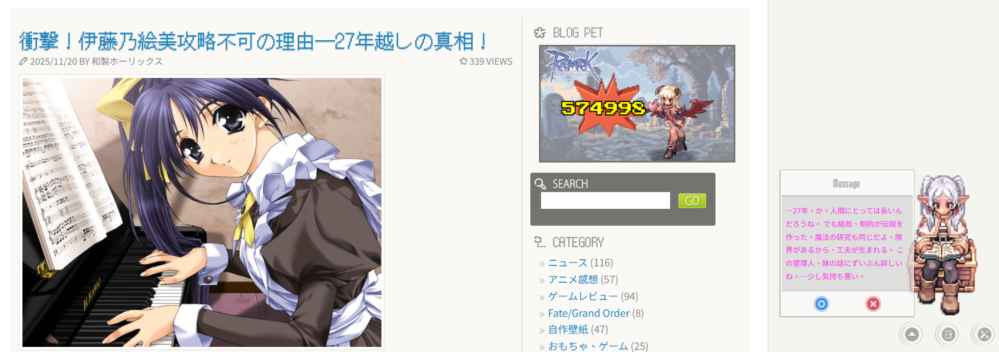

# MP Ukagaka

一個用於在 WordPress 網站上創建和顯示互動式偽春菜（伺か）角色的外掛，具備 AI 頁面感知功能。

[](https://github.com)
[](https://wordpress.org/)
[](https://www.php.net/)

🌍 **其他語言**: [English](README.md) | [日本語](README_ja.md)

## 📸 預覽截圖



_芙莉蓮角色根據文章內容顯示 AI 生成的對話_

## 📖 簡介

MP Ukagaka 讓你能夠為 WordPress 網站創建自訂的互動式偽春菜。這個版本基於經典的 MP Ukagaka 外掛進行了全面現代化，具備增強的安全性、效能改進、模組化架構和先進的 AI 功能。

### 經典功能

- **多角色支援**：創建和管理多個春菜角色
- **自訂對話**：為每個角色設計專屬對話訊息
- **外部對話檔案**：支援從 TXT 或 JSON 檔案載入對話
- **自動對話**：可設定間隔的自動訊息輪播
- **通用訊息**：可套用到所有角色的共用訊息
- **頁面排除**：控制春菜在哪些頁面顯示
- **多語言**：支援繁體中文、日文、英文等多種語言

### 🚀 AI 頁面感知（v2.0.0 新功能）

本外掛現在包含智慧 AI 功能，可分析頁面內容並生成個性化回應：

- **多 AI 提供商支援**：
  - **Google Gemini**：快速高效（gemini-2.5-flash、gemini-2.5-pro）
  - **OpenAI GPT**：強大的語言模型（GPT-4o、GPT-4o-mini、GPT-3.5-turbo）
  - **Anthropic Claude**：進階推理能力（Claude Sonnet 4.5）
- **智慧內容分析**：自動擷取並分析頁面標題和內容
- **可設定觸發條件**：設定哪些頁面觸發 AI 對話
- **機率控制**：調整 AI 回應頻率（1-100%）以管理 API 成本
- **可自訂人格**：透過系統提示詞設計角色個性
- **視覺自訂**：自訂 AI 對話文字顏色
- **顯示時間控制**：防止 AI 對話被自動對話覆蓋
- **多語言 AI**：生成繁體中文、日文或英文回應
- **首次訪客打招呼**：用個性化 AI 問候歡迎新訪客（需要 Slimstat 外掛）

### 🧪 本機 LLM 支援（測試階段）

> ⚠️ **注意**：LLM 功能目前處於**測試階段（BETA）**，功能可能不穩定，請謹慎使用。

外掛現在支援透過 Ollama 整合本機 LLM，無需 API 費用即可生成對話：

- **Ollama 整合**：連接本地或遠程 Ollama 實例
- **遠程連接支援**：支援 Cloudflare Tunnel、ngrok 或其他隧道服務
- **取代內建對話**：可選擇使用 AI 生成的內容取代靜態對話
- **無需 API Key**：完全免費使用你自己的 LLM 設定
- **智慧連接檢測**：自動調整本地與遠程連接的超時設定
- **模型支援**：相容多種 Ollama 模型（Qwen3、Llama、Mistral 等）
- **思考模式控制**：可選擇關閉 Qwen3 等模型的思考行為

**設定需求：**

- 安裝並運行 [Ollama](https://ollama.ai/)（本地或遠程伺服器）
- 下載所需模型（例如：`ollama pull qwen3:8b`）
- 在外掛設定中配置端點 URL（本地：`http://localhost:11434` 或遠程：`https://your-domain.com`）
- 詳細的設定說明請參見 [USER_GUIDE.md](/docs/USER_GUIDE.md)

**目前限制：**

- 功能處於測試階段
- 遠程設定可能會有連接問題
- 回應時間可能因模型和連接類型而異

## 📦 安裝

1. **下載外掛**

   - 從本儲存庫下載
   - 或將本儲存庫克隆到 WordPress 外掛目錄

2. **安裝外掛**

   ```bash
   # 前往 WordPress 外掛目錄
   cd /path/to/wordpress/wp-content/plugins/

   # 解壓縮或克隆外掛
   unzip mp-ukagaka.zip
   ```

3. **啟用外掛**

   - 前往 WordPress 後台 → 外掛
   - 找到「MP Ukagaka」並點擊「啟用」

4. **設定**
   - 前往 **設定 → MP Ukagaka**
   - 配置通用設定並創建你的第一個春菜角色
   - （可選）在「AI 設定」區塊啟用 AI 功能

## ⚙️ 設定

### 基本設定

1. **通用設定**

   - 選擇預設春菜角色
   - 啟用/停用顯示
   - 設定自動對話間隔
   - 設定頁面排除規則

2. **創建角色**

   - 前往「春菜們」分頁
   - 添加新角色並設定圖片和對話
   - 配置角色專屬設定

3. **對話設定**
   - **重要**：所有對話必須以外部檔案形式存放（TXT 或 JSON 格式）
   - 將對話檔案放在 `dialogs/` 資料夾中
   - 儲存角色設定時會自動生成對話檔案
   - 你也可以手動在 `dialogs/` 資料夾中創建/編輯對話檔案

### AI 頁面感知設定

1. **啟用 AI 功能**

   - 前往 設定 → MP Ukagaka → AI 設定
   - 勾選「啟用頁面感知功能」

2. **選擇 AI 提供商**

   **Google Gemini**（推薦新手使用）：

   - 從 [Google AI Studio](https://makersuite.google.com/app/apikey) 取得 API Key
   - 選擇「Gemini」作為提供商
   - 輸入 API Key
   - 預設模型：gemini-2.5-flash

   **OpenAI GPT**：

   - 從 [OpenAI Platform](https://platform.openai.com/api-keys) 取得 API Key
   - 選擇「OpenAI」作為提供商
   - 輸入 API Key
   - 選擇模型：gpt-4o-mini（推薦）、gpt-4o 或 gpt-3.5-turbo

   **Anthropic Claude**：

   - 從 [Anthropic Console](https://console.anthropic.com/) 取得 API Key
   - 選擇「Claude」作為提供商
   - 輸入 API Key
   - 模型：claude-sonnet-4-5-20250929

3. **配置 AI 設定**

   - **語言**：選擇回應語言（繁體中文、日文、英文）
   - **人格設定**：定義角色個性（例如：「你是一個傲嬌的桌面助手『春菜』。你會用簡短、帶點傲嬌的語氣評論文章內容。回應請保持在 40 字以內。」）
   - **機率**：設定 AI 觸發機率（1-100%，建議 10-30% 以控制成本）
   - **觸發頁面**：指定觸發 AI 的頁面（例如：「is_single」只在單篇文章觸發）
   - **文字顏色**：自訂 AI 對話文字顏色
   - **顯示時間**：設定 AI 訊息顯示多久後恢復自動對話（建議 5-10 秒）

4. **首次訪客打招呼**（可選）

   - 啟用「首次訪客打招呼」
   - 設定打招呼提示詞
   - 需要 Slimstat 外掛以獲得增強的訪客追蹤

5. **儲存設定**
   - 點擊「儲存」按鈕
   - 在單篇文章頁面測試 AI 回應

### 本機 LLM (Ollama) 設定（測試階段）

> ⚠️ **警告**：此功能目前處於**測試階段（BETA）**，使用風險自負。

1. **安裝 Ollama**

   - 在你的本地機器或伺服器上下載並安裝 [Ollama](https://ollama.ai/)
   - 啟動 Ollama 服務
   - 下載模型：`ollama pull qwen3:8b`（或你偏好的模型）

2. **配置外掛設定**

   - 前往 設定 → MP Ukagaka → LLM 設定
   - 勾選「啟用 LLM (Ollama)」
   - 輸入 Ollama 端點：
     - **本地**：`http://localhost:11434`（預設）
     - **遠程**：`https://your-domain.com`（Cloudflare Tunnel、ngrok 等）
   - 輸入模型名稱（例如：`qwen3:8b`、`llama3.2`、`mistral`）

3. **可選設定**

   - **取代內建對話**：啟用以使用 LLM 生成的對話取代靜態對話
   - **關閉思考模式**：建議用於 Qwen3 模型以提高回應速度
   - **測試連接**：使用「測試 Ollama 連接」按鈕驗證設定

4. **遠程連接（Cloudflare Tunnel）**
   - 設定 Cloudflare Tunnel 指向 `http://localhost:11434`
   - 使用隧道 URL 作為端點（例如：`https://your-domain.com`）
   - 外掛會自動檢測遠程連接並調整超時設定

## 🔧 進階功能

### 外部對話檔案

> ⚠️ **重要**：自版本 2.1.3 起，系統**固定使用外部對話檔案**。所有對話必須以外部檔案形式存放在 `dialogs/` 資料夾中。內部對話儲存功能已移除。

你可以從外部檔案載入對話（TXT 或 JSON 格式）：

**TXT 格式**（`dialogs/角色名.txt`）：

```
對話1

對話2

對話3
```

**JSON 格式**（`dialogs/角色名.json`）：

```json
{
  "messages": ["對話1", "對話2", "對話3"]
}
```

### 頁面觸發條件

使用 WordPress 條件標籤來設定 AI 觸發條件：

- `is_single` - 單篇文章頁面
- `is_page` - 靜態頁面
- `is_home` - 首頁
- `is_front_page` - 網站首頁
- 多個條件：`is_single,is_page`

### 人格設定範例

**友善角色**：

```
你是一個友善的桌面助手。你會用親切的語氣簡單評論文章內容，回應請保持在 30 字以內。
```

**專業角色**：

```
你是專業的部落格助手。請提供簡短、有見地的文章評論。回應保持在 50 字以內。
```

**俏皮角色**：

```
你是一個俏皮的桌面寵物。用有趣的方式簡短（40字以內）評論文章內容。
```

## 🔒 安全功能

- **CSRF 保護**：所有表單提交使用 WordPress nonce 驗證
- **XSS 防護**：使用 WordPress 核心函數進行輸入過濾
- **API Key 加密**：API Key 在儲存前使用 AES-256-CBC 加密
- **安全檔案操作**：所有檔案 I/O 使用 WordPress Filesystem API 並進行路徑驗證
- **目錄遍歷防護**：驗證檔案路徑以防止未授權存取
- **輸入驗證**：所有使用者輸入都經過清理和驗證

## 📝 檔案結構

```
mp-ukagaka/
├── includes/                      # PHP 模組
│   ├── core-functions.php        # 核心功能（設定管理）
│   ├── utility-functions.php     # 工具函數（安全性）
│   ├── ai-functions.php          # AI 功能（雲端 API + Ollama）
│   ├── llm-functions.php         # LLM 功能（Ollama 專用）- 測試階段
│   ├── ukagaka-functions.php     # 春菜管理
│   ├── ajax-handlers.php         # AJAX 處理器
│   ├── frontend-functions.php    # 前端功能
│   └── admin-functions.php       # 後台功能
├── dialogs/                      # 對話檔案（TXT/JSON）
├── images/                       # 圖片資源
│   └── shell/                    # 角色圖片
├── languages/                    # 語言檔案
├── docs/                         # 文檔
├── mp-ukagaka.php               # 主程式（模組載入器）
├── ukagaka-core.js              # 前端 JavaScript（核心）
├── ukagaka-features.js          # 前端 JavaScript（功能）
├── ukagaka_cookie.js            # Cookie 工具
└── mpu_style.css                # 樣式表
```

## ❓ 常見問題

### 如何控制 API 成本？

- 將**機率**設為較低值（10-20%）
- 使用較快/較便宜的模型（例如 gemini-2.5-flash、gpt-4o-mini）
- 限制觸發頁面（例如只在 `is_single` 觸發）

### AI 為什麼沒有觸發？

1. 確認已在設定中啟用 AI
2. 驗證 API Key 是否正確
3. 確保頁面符合觸發條件（例如 `is_single`）
4. 檢查內容長度是否達到最低要求（500 字元）
5. 確認機率設定（測試時可嘗試 100%）
6. 檢查瀏覽器控制台是否有 JavaScript 錯誤

### AI 對話被自動對話覆蓋？

增加**AI 對話顯示時間**設定（以秒為單位）。這控制 AI 訊息顯示多久後恢復自動對話。建議：5-10 秒。

### 如何自訂 AI 回應風格？

編輯**人格設定（System Prompt）**欄位。這定義了角色的個性和回應風格。建議保持在 200 字以內。

### LLM 連接失敗

1. **本地連接**

   - 確認 Ollama 服務正在運行
   - 檢查端口是否為 11434
   - 嘗試在瀏覽器訪問 `http://localhost:11434`

2. **遠程連接**
   - 確認 Cloudflare Tunnel 服務正在運行
   - 檢查隧道 URL 是否正確
   - 確認網絡連接正常

### LLM 回應速度慢

1. 使用更快的模型（如 `qwen3:8b`）
2. 啟用「關閉思考模式」選項
3. 遠程連接會有額外延遲（正常現象）

## 🐛 疑難排解

### AI 沒有觸發

- 檢查瀏覽器控制台錯誤
- 驗證 API Key 有效性
- 將機率設為 100% 測試
- 確保頁面內容足夠（>500 字元）

### 角色沒有顯示

- 確認「預設顯示春菜」設定已啟用
- 驗證角色圖片路徑正確
- 清除瀏覽器快取
- 檢查頁面排除規則

### 對話沒有載入

- 驗證對話檔案格式（TXT 或 JSON）
- 確認檔案命名與角色設定一致
- 確保檔案在 `dialogs/` 資料夾中
- 檢查檔案權限

## 📜 版本歷史

### 版本 2.1.5（2025-12-13）

**結構變更：**

- 📁 **重構**：將後台選項頁面重新組織到專用的 `options/` 資料夾
  - 所有選項頁面檔案（options.php、options_page*.php）現已集中到 `options/` 目錄
  - 改善程式碼組織和可維護性
  - 更好的關注點分離（includes 和 options 分離）

**改進：**

- ✨ **LLM**: 改進隨機對話提示詞系統，新增分類提示詞（問候、閒聊、觀察、情境、互動）
- ✨ **LLM**: 新增時間感知情境提示詞（早上、下午、晚上、深夜）
- 🌍 **i18n**: 完整翻譯檔審查與更新
- 🌍 **i18n**: 新增所有錯誤訊息和成功訊息的翻譯
- 🌍 **i18n**: 所有 API 錯誤訊息現已正確國際化
- 🔧 **i18n**: 更新翻譯編譯腳本，改善 .po 到 .mo 的轉換

**增強：**

- 🔧 **LLM**: 提示詞多樣性從 7 個提升到 20+ 個，涵蓋 5 個類別
- 🔧 **LLM**: 更自然和情境化的提示詞表達
- 🔧 **i18n**: llm-functions.php、ai-functions.php 和 ajax-handlers.php 中的所有硬編碼字串現已使用翻譯函數

### 版本 2.1.4（2025-12-11）

**改進：**

- ⚡ **AI**：將 Gemini 的 `maxOutputTokens` 從 100 增加到 500，以防止頁面感知處理時回應被截斷（允許更長、更完整的回應）。
- 💰 **AI**：OpenAI 和 Claude 維持 100 tokens 以控制成本。

**錯誤修正：**

- 🐛 **UI**：修正後台設定中「AI 對話文字顏色」輸入框的顯示問題（解決因 CSS padding 衝突導致顏色選擇器縮成一條線的問題）。

### 版本 2.1.3（2025-12-10）

**重大變更：**

- 🔄 **重大變更**：系統現已固定使用外部對話檔案（TXT/JSON 格式）
  - 已移除內部對話儲存功能
  - 所有對話必須以外部檔案形式存放在 `dialogs/` 資料夾中
  - 儲存角色設定時會自動生成對話檔案
- 🎨 **全新**：後台管理介面全面重新設計，採用 Claude 風格
  - 現代簡潔的設計，溫暖的配色方案
  - 改進的標籤頁導航和內容佈局
  - 更好的訊息對齊和格式化
  - 響應式設計，支援行動裝置

**改進：**

- 🔧 **改善**：所有後台頁面的訊息顯示一致性
- 🔧 **改善**：修正重複訊息顯示問題
- 🔧 **改善**：優化後台介面寬度（75%，靠左對齊）
- 🔧 **改善**：移除陰影效果，更簡潔的外觀
- 🔧 **改善**：恢復 WordPress 預設背景色

**錯誤修正：**

- 🐛 **修正**：訊息框對齊問題
- 🐛 **修正**：多個後台頁面儲存訊息重複顯示的問題

### 版本 2.1.2（2025-12-08）

**新功能：**

- ✨ **新增（測試階段）**：透過 Ollama 整合支援本機 LLM
- ✨ **新增**：Cloudflare Tunnel 和遠程連接支援
- ✨ **新增**：本地與遠程連接的動態超時管理
- ✨ **新增**：自動服務可用性檢查

**改進：**

- 🔧 **改善**：遠程連接的錯誤訊息更詳細
- 🔧 **改善**：Ollama 端點的 URL 驗證
- 🔧 **改善**：連接類型檢測（本地/遠程）

**錯誤修正：**

- 🐛 **修正**：LLM 啟用勾選框狀態持久化問題

### 版本 2.1.1（2025-11-28）

**錯誤修正：**

- 🐛 改善 CSS 穩定性，提升主題相容性（Twenty Ten 等）
- 🐛 導航按鈕 hover 效果現在在所有主題中正常運作
- 🐛 移除對話框按鈕（OK/Cancel）的 focus 虛線框

**改進：**

- 🔧 使用 Flexbox 佈局改善按鈕對齊
- 🔧 添加 `!important` 規則防止主題 CSS 覆蓋
- 🔧 控制面板元素完整 CSS 重置

### 版本 2.1.0（2025-11-26）

**新功能：**

- ✨ 可配置打字速度（10-200 毫秒/字）
- 🔒 API Key 使用 AES-256-CBC 加密
- 🔒 使用 WordPress Filesystem API 進行安全檔案操作
- 🔒 目錄遍歷防護

**改進：**

- 🔧 已設定的 API Key 顯示視覺指示器
- 🔧 改善檔案操作錯誤訊息
- 🔧 向下相容現有的明文 API Key

### 版本 2.0.0（2025-11-22）

**架構改進：**

- ✨ 完全模組化架構（7 個模組）
- ✨ 主程式檔案精簡至約 85 行

**新功能：**

- ✨ AI 頁面感知，支援多提供商（Gemini、OpenAI、Claude）
- ✨ 首次訪客打招呼（Slimstat 整合）
- ✨ 可配置 AI 文字顏色和顯示時間

**改進：**

- 🔧 JSON 對話檔案支援
- 🔧 改善錯誤處理和日誌

## 👥 致謝

- **原作者**：Ariagle _（原站點已停止運營）_
- **維護者**：Horlicks (https://www.moelog.com/)
- **靈感來源**：經典 MP Ukagaka 外掛 / 伺か (Ukagaka)

## 📄 授權

本外掛基於原始 MP Ukagaka 外掛。請參閱原始外掛的授權條款。

## 🔗 連結

- [維護者部落格](https://www.moelog.com/)
- [維基百科 - 伺か](http://en.wikipedia.org/wiki/Ukagaka)
- [Google AI Studio](https://makersuite.google.com/app/apikey)（Gemini API Key）
- [OpenAI Platform](https://platform.openai.com/api-keys)（OpenAI API Key）
- [Anthropic Console](https://console.anthropic.com/)（Claude API Key）

## 💬 支援

如有問題或建議：

- 訪問[維護者部落格](https://www.moelog.com/)
- 查看 WordPress 後台的常見問題
- 參閱上方疑難排解章節
- 在 GitHub 開立 Issue

---

**Made with ❤ for WordPress 社群**
