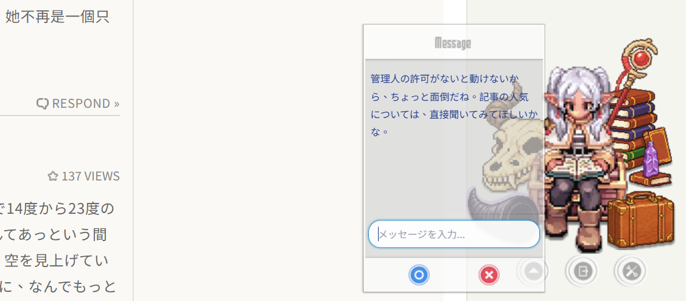

# WordPress Abilities API Integration Guide (English)

**MP Ukagaka** leverages the **Abilities API** built into the WordPress 6.9+ core, granting your AI characters (Ukagaka) the ability to interact directly with your WordPress site.

This feature allows AI characters to use registered "Abilities," such as querying site information, managing posts, or executing other WordPress functions, evolving them from simple chatbots into site management assistants.

## What is the Abilities API?

The **Abilities API** is a core feature introduced in WordPress 6.9 (released December 2, 2025). It provides a standardized way to register and discover WordPress functionalities (Abilities).

- **Past (WP < 6.9)**: Depended on the **MCP Adapter** plugin to provide registry functionality.
- **Present (WP >= 6.9)**: The registry is now part of the WordPress core.

Therefore, as long as your WordPress version is 6.9 or higher, **no additional plugins are required** for MP Ukagaka to utilize these functions.

## Why is the MCP Adapter not needed?

Because `mp-ukagaka` calls the core function `wp_register_ability()`, directly registering abilities (e.g., "Get Popular Posts") into the WordPress core registry.

The AI logic reads abilities directly from this core registry and passes them as "Tools" to models like Gemini, Claude, OpenAI, and Ollama. Since the registration and discovery mechanisms are built-in, the MCP Adapter is no longer required as an intermediary.

- **Internal Use (Internal Agent)**: For Ukagaka use → **No MCP Adapter needed** (direct access to Core API).
- **External Use (External Agent)**: For Cursor or Claude Desktop → **May need MCP Adapter** (exposing core abilities via standard MCP protocol).

## Supported Models

The following AI models currently support tool calling in this plugin:

- **Google Gemini**: Gemini 2.0 Flash (Recommended), Gemini 1.5 Pro, etc.
- **Anthropic Claude**: Claude 3.5 Sonnet, etc.
- **OpenAI**: GPT-4o, GPT-4o-mini, etc.
- **Ollama**: Qwen 2.5, Llama 3.1, etc. (Models supporting Tool Calling).

## Permissions and Security

Core abilities involving sensitive operations (File operations, Delete posts, etc.) are automatically restricted. If triggered by non-admin users, the system will intercept the request and return an "Insufficient Permissions" notice to ensure security.



_Permission Control: System reaction when non-admin users trigger sensitive MCP commands_

## How to Add Abilities (Developer Guide)

MP Ukagaka automatically detects and uses all Abilities registered to the WordPress core. You can add abilities using two methods:

### Method 1: Standard WordPress Method (For any Plugin/Theme)

This is the official WordPress standard. Any plugin can register abilities this way, and MP Ukagaka will automatically read and use them.

```php
// In your custom plugin or theme's functions.php
add_action( 'wp_abilities_api_init', function() {
    if ( function_exists( 'wp_register_ability' ) ) {
        wp_register_ability(
            'my-plugin/say-hello', // Unique identifier
            array(
                'label'       => 'Say Hello',
                'description' => 'A simple ability that says hello.',
                'input_schema' => array(
                    'type' => 'object',
                    'properties' => array(
                        'name' => array( 'type' => 'string' ),
                    ),
                ),
                'execute_callback' => function( $args ) {
                    $name = isset( $args['name'] ) ? $args['name'] : 'World';
                    return "Hello, " . $name . "!";
                },
            )
        );
    }
} );
```

### Method 2: MP Ukagaka Modular Method (Recommended for internal development)

If you are developing the `mp-ukagaka` plugin itself, we recommend using our built-in modular architecture. Based on the development experience with `class-wp-postviews-ability.php` and `class-wp-bot-blocker-ability.php`, here is the **Step-by-Step SOP and Pitfall Avoidance Guide**.

#### 1. Architecture Overview

```text
includes/mcp-tools/
├── manager.php                  # Automatically discovers and registers all ability classes
└── abilities/
    ├── class-wp-postviews-ability.php     # Example: Read-only, no parameters
    └── class-wp-bot-blocker-ability.php   # Example: Multiple abilities, with params & Enum
```

**Execution Flow:**

1. `manager.php` → `register_abilities()` → calls your `YourClass::register()` during `wp_abilities_api_init`.
2. `abilities-integration.php` → `mpu_get_mcp_tools_for_llm()` → formats tool schemas according to different LLMs.
3. LLM requests tool call → `mpu_execute_mcp_tool()` → `$ability->execute($args)` → calls your defined Callback.

**Admin Permission Restriction:** Tool definitions are **not** sent to non-admin visitors. Only users who `current_user_can('manage_options')` can trigger tool calls. This restriction is enforced at the integration layer, not within the ability itself.

#### 2. Step-by-Step SOP

**Step 1: Create the Ability Class File**

File path: `includes/mcp-tools/abilities/class-{slug}-ability.php`

```php
<?php

namespace MP_Ukagaka\McpTools\Abilities;

class Wp_YourFeature_Ability
{
    public static function register()
    {
        // Guard: ensure wp_register_ability exists
        if (!function_exists('wp_register_ability')) {
            return;
        }

        // Guard: check external plugin dependencies (if any)
        if (!function_exists('your_plugin_function')) {
            return;
        }

        wp_register_ability('mp-ukagaka/your-ability-name', array(
            'label'               => __('Human readable ability name', 'mp-ukagaka'),
            'description'         => __('What this ability does. Semantics must be extremely precise.', 'mp-ukagaka'),
            'category'            => 'mp-ukagaka',
            'input_schema'        => array(
                'type'       => 'object',
                'properties' => array(
                    'param_name' => array(
                        'type'        => 'string',
                        'description' => __('Precise parameter description. If Enum, add "Use this value when... " for each value.', 'mp-ukagaka'),
                    ),
                ),
                'required' => array('param_name'),
            ),
            'execute_callback'    => [self::class, 'your_callback'],
            'permission_callback' => function () { return true; },
        ));
    }

    public static function your_callback($args)
    {
        // Your processing logic
        return 'Result string or array';
    }
}
```

**Step 2: Register the Class in manager.php**

Add the full class namespace to the `$abilities` array in `includes/mcp-tools/manager.php`:

```php
protected static $abilities = [
    '\MP_Ukagaka\McpTools\Abilities\Wp_PostViews_Ability',
    '\MP_Ukagaka\McpTools\Abilities\Wp_Bot_Blocker_Ability',
    '\MP_Ukagaka\McpTools\Abilities\Wp_YourFeature_Ability',  // ← Add here
];
```

**Step 3: Verify Registration**

Log in to WordPress as an administrator, and type `/debug_mcp` in the Frieren chat window. Ensure that:

- Your ability name appears in the "Tools found:" list.
- The "Tool count" has increased by the number of abilities you added.

**Step 4: Chat Testing**

Ask Frieren to use the ability. After she responds, verify the actual data source (database, Option, etc.) to ensure the result is correct.

#### 3. Required Fields

The following 5 fields are **absolutely required** (missing any will lead to a silent error):

| Field                 | Required | Description                                                                                                 |
| --------------------- | -------- | ----------------------------------------------------------------------------------------------------------- |
| `label`               | **YES**  | If missing, an `InvalidArgumentException` is thrown (swallowed internally), and the ability won't register. |
| `description`         | **YES**  | The sole basis for the LLM to decide when to call this tool.                                                |
| `category`            | **YES**  | Must be set to `'mp-ukagaka'`.                                                                              |
| `execute_callback`    | **YES**  | Please use the `[self::class, 'method_name']` array format.                                                 |
| `permission_callback` | **YES**  | Write `function () { return true; }` (Admin check is already done externally).                              |

#### 4. input_schema Rules

**Abilities without parameters "MUST" define an input_schema:**

```php
// ✅ Correct approach — LLM sends {}, validate_input sees defined schema → Pass
'input_schema' => array(
    'type'       => 'object',
    'properties' => new \stdClass(),  // ← Must use stdClass, not [] ([] becomes an array, not an object)
),

// ❌ Incorrect approach — LLM sends {} (not null), validate_input receives it and returns WP_Error → Frieren will say "I couldn't get the information"
// (Completely omitting input_schema is wrong)
```

**Abilities with parameters:**

```php
'input_schema' => array(
    'type'       => 'object',
    'properties' => array(
        'my_param' => array(
            'type'        => 'string',
            'description' => '...',
        ),
    ),
    'required' => array('my_param'),
),
```

#### 5. Writing Precise Descriptions for the LLM

This is the most critical step. Vague descriptions will cause the LLM to choose the wrong tool or parameters.

**Ability-level descriptions:**
Clearly state **what it does** and **when to use it**:

```php
// ❌ Too vague
'description' => 'Clear the log file or reset the IP ban list.'

// ✅ Intent is clear
'description' => 'Clear the Moelog Bot Blocker intercept records or reset the IP ban list.'
```

**Enum parameter descriptions:**
Always add a **"Use this when..."** guide for each Enum value:

```php
// ❌ Will cause the LLM to guess
'description' => 'What to clear: "logs", "ips", or "both".'

// ✅ Precisely guides the LLM based on user intent
'description' =>
    '"logs" — Deletes all intercept records in the database. Use this when the user asks to clear records, history, logs, or intercept data. ' .
    '"ips" — Only clears the IP ban list. Use this when the user asks to unblock IPs or reset the ban list. ' .
    '"both" — Clears both.'
```

**Action Vocabulary (Action vs. Query):**
Avoid using file system metaphors to describe database operations:

- ❌ "log file" 👉 ✅ "log records in the database"
- ❌ "config file" 👉 ✅ "settings stored in WordPress options"
- ❌ "reset file" 👉 ✅ "delete records from the table"

**Post-operation Validation Return Value:**
If the ability modifies data, please return the validation result so the LLM can accurately report back:

```php
public static function clear_callback($args)
{
    moelog_bot_blocker_clear_logs();
    return 'Cleared the intercept log table. All records deleted.'; // Lets the LLM know it succeeded
}
```

#### 6. Naming Conventions

- **Ability name format:** `mp-ukagaka/{slug}` — Only lowercase letters, numbers, and hyphens (`-`) are allowed.
  - Strictly adhere to the regex: `/^[a-z0-9-]+\/[a-z0-9-]+$/`
  - **No underscores (`_`) allowed**.
  - ✅ `mp-ukagaka/get-bot-blocker-stats`
  - ❌ `mp-ukagaka/get_bot_blocker_stats`
- **Class name:** `Wp_{Feature}_Ability` (PascalCase with underscores).
- **File name:** `class-{slug}-ability.php` (kebab-case).
- **Note:** `abilities-integration.php` automatically converts `/` to `__` when sending to the LLM (to comply with OpenAI's regex limits).

#### 7. External Plugin Integration Pattern

**Prioritize calling the plugin's own public functions**, avoiding direct manipulation of the DB or Options:

```php
// ✅ Calling plugin's own function — Ensures internal log rotation, transients, and action hooks are triggered
moelog_bot_blocker_ban_ip($ip);
moelog_bot_blocker_log('MANUAL_BAN', ['source' => 'Frieren API', 'ip' => $ip]);

// ❌ Direct option modification — Bypasses plugin core logic
$banned = get_option('moelog_bot_blocker_banned_ips', []);
$banned[] = $ip;
update_option('moelog_bot_blocker_banned_ips', $banned);
```

#### 8. Checklist Before Shipping

- [ ] Class file created in `includes/mcp-tools/abilities/`.
- [ ] Class added to the `$abilities` array in `manager.php`.
- [ ] All 5 required fields are set (`label`, `description`, `category`, `execute_callback`, `permission_callback`).
- [ ] `input_schema` defined (even for parameter-less abilities using `new \stdClass()`).
- [ ] Ability is named `mp-ukagaka/{kebab-case}` with no underscores.
- [ ] Plugin dependency guards added (`function_exists()`).
- [ ] Precise semantics in descriptions — Enum values include "Use this when..." guidance.
- [ ] `/debug_mcp` confirms the tool appears in the list.
- [ ] End-to-end chat testing passed, and data is modified correctly.
