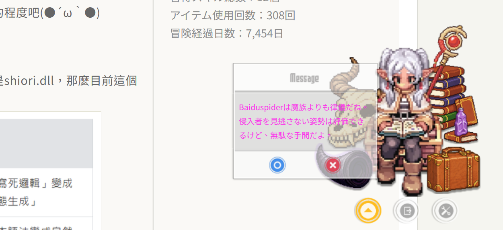
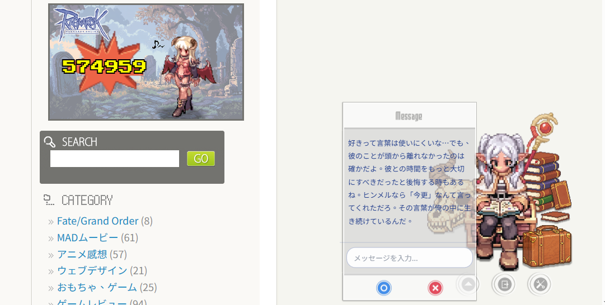

# MP Ukagaka ユーザーガイド

> 🎭 WordPress サイトにかわいい伺かを追加しよう

---

## 📑 目次

1. [はじめに](#はじめに)
2. [インストールと有効化](#インストールと有効化)
3. [クイックスタート](#クイックスタート)
4. [基本設定](#基本設定)
5. [伺か管理](#伺か管理)
6. [会話設定](#会話設定)
7. [AI 機能設定](#ai-機能設定)
8. [LLM 機能設定（テスト段階）](#llm-機能設定テスト段階)
9. [インタラクティブチャットモード（v2.3.0）](#インタラクティブチャットモードv230)
10. [思考モード（v2.3.0）](#思考モードv230)
11. [拡張機能](#拡張機能)
12. [よくある質問](#よくある質問)

---

## はじめに

MP Ukagaka は WordPress プラグインで、サイトにインタラクティブなデスクトップマスコットキャラクター（伺か）を表示できます。キャラクターはカスタムダイアログメッセージを表示でき、AI インテリジェントページ感知機能をサポートし、記事内容に基づいて自動的にコメントを生成します。

### 主な機能

- 🎨 **複数キャラクターサポート**：複数の伺かキャラクターを作成・管理
- 💬 **カスタムダイアログ**：各キャラクターに専用のダイアログ内容を設定
- 🤖 **汎用 LLM インターフェース**：Ollama、Gemini、OpenAI、Claude の 4 大 AI サービスをサポート
- 🧠 **AI ページ感知**：記事内容に基づいて自動的にコメントを生成
- 🌍 **多言語**：繁体字中国語、日本語、英語をサポート
- 📁 **外部ダイアログファイル**：TXT と JSON 形式のダイアログファイルをサポート
- ⚙️ **高度にカスタマイズ可能**：タイプ速度、表示位置、スタイルなどを調整可能
- 🎭 **カスタムプロンプトシステム**：Markdown/XML 形式の System Prompt をサポート、構造化されたキャラクター設定

---

## インストールと有効化

### システム要件

- WordPress 5.0 以上
- PHP 7.4 以上
- JavaScript をサポートするモダンブラウザ

### インストール手順

1. プラグイン ZIP ファイルをダウンロード
2. WordPress 管理画面にログイン → **プラグイン** → **新規追加**
3. 「プラグインをアップロード」をクリック、ダウンロードした ZIP ファイルを選択
4. 「今すぐインストール」をクリック
5. インストール完了後、「プラグインを有効化」をクリック

### 初期設定

有効化後、**設定** → **MP Ukagaka** で設定を行います。

---

## クイックスタート

### 5 分でクイック設定

1. **設定ページに移動**
   - WordPress 管理画面 → 設定 → MP Ukagaka

2. **デフォルト伺かを確認**
   - 「通用設定」ページで「デフォルト伺か」が選択されていることを確認
   - 「デフォルトで伺かを表示」と「デフォルトで吹き出しを表示」にチェック

3. **設定を保存**
   - 「保存」ボタンをクリック

4. **効果を確認**
   - サイトのフロントエンドに移動し、ページ右下に伺かキャラクターが表示されるはず

---

## 基本設定

**設定** → **MP Ukagaka** → **通用設定** に移動

### 表示設定

| 設定項目                   | 説明                                           |
| -------------------------- | ---------------------------------------------- |
| デフォルト伺か             | デフォルトで表示するキャラクターを選択         |
| デフォルトで伺かを表示     | デフォルトでキャラクター画像を表示するかどうか |
| デフォルトで吹き出しを表示 | デフォルトで吹き出しを表示するかどうか         |

### ダイアログ設定

| 設定項目       | 説明                                                     |
| -------------- | -------------------------------------------------------- |
| デフォルト会話 | 「ランダム」または「最初の一つ」                         |
| 会話順序       | クリック時の次の会話は「順序」または「ランダム」         |
| 伺かをクリック | キャラクタークリック時の動作（次を表示または何もしない） |

### 自動ダイアログ

| 設定項目                   | 説明                                                       |
| -------------------------- | ---------------------------------------------------------- |
| 自動ダイアログ機能を有効化 | 自動的にダイアログを切り替えるかどうか                     |
| 自動ダイアログ間隔         | 自動切り替えの間隔（3-30 秒）                              |
| タイプ効果速度             | ダイアログのタイプアニメーション速度（10-200 ミリ秒/文字） |

### 外部ダイアログファイル

| 設定項目                     | 説明                                                |
| ---------------------------- | --------------------------------------------------- |
| 外部ダイアログファイル形式   | TXT または JSON 形式を選択                          |
| 外部ダイアログファイルを使用 | `dialogs/` フォルダからダイアログを読み込むかどうか |

### ページ除外

「以下のページで伺かを表示しない」テキストボックスに、伺かを表示したくないページの URL を入力、1 行に 1 つ。

あいまいマッチをサポート：URL の末尾に `(*)` を追加すると、すべてのサブページにマッチ。

**例：**

```
/admin/
/wp-admin/(*)
/private-page/
```

### スタイル設定

| 設定項目               | 説明                                                                       |
| ---------------------- | -------------------------------------------------------------------------- |
| カスタムスタイルを使用 | 有効にすると、プラグインは内蔵 CSS を読み込まず、外観を自分で制御可能      |
| カスタムスタイルリンク | `<link>` タグを入力して、独自の CSS スタイルシートを読み込むことができます |

> 💡 **ヒント**：このオプションは上級ユーザー向けです。有効にした場合、**テーマの CSS** または「カスタムスタイルリンク」フィールドから独自のスタイルシートを読み込む必要があります。CSS をカスタマイズする予定がない場合は、このオプションをオフのままにして、プラグイン内蔵のスタイルを使用してください。

**カスタムスタイルリンクの例：**

```html
<link
  rel="stylesheet"
  href="https://example.com/custom-ukagaka.css"
  type="text/css"
/>
```

---

## 伺か管理

### 既存の伺かを表示

**設定** → **MP Ukagaka** → **伺かたち** に移動

このページでは：

- 作成済みのすべての伺かを表示
- 伺かの名前、画像、ダイアログを編集
- デフォルト以外の伺かを削除
- 表示するかどうかを設定（表示チェックボックス）

### 新しい伺かを作成

> 📘 **上級ガイド**：完全な LLM サポートを含むキャラクター人格を作成する場合は、[人格作成ガイド (GHOST_CREATE_GUIDE.md)](GHOST_CREATE_GUIDE.md) を参照してください。

**設定** → **MP Ukagaka** → **新しい伺かを作成** に移動

#### 必須フィールド

| フィールド | 説明                        | 例                                |
| ---------- | --------------------------- | --------------------------------- |
| 名前       | 伺かの名前                  | `フリーレン`                      |
| 画像       | 伺か画像の完全 URL          | `https://example.com/ukagaka.png` |
| ダイアログ | ダイアログ内容、1 行に 1 つ | 下記の例を参照                    |

#### ダイアログ内容例

```
私のサイトへようこそ！
今日はいい天気だね〜
最新の記事を見てみる？
魔法は時間をかけて研究するものだ。
```

#### オプションフィールド

| フィールド               | 説明                                               |
| ------------------------ | -------------------------------------------------- |
| ダイアログファイル名     | 外部ダイアログファイルの名前（拡張子なし）         |
| ダイアログファイルを生成 | チェックすると対応するダイアログファイルを自動生成 |

### 外部ダイアログファイル形式

#### TXT 形式

ファイル場所：`wp-content/plugins/mp-ukagaka/dialogs/キャラクター名.txt`

```
最初のダイアログ

2番目のダイアログ

3番目のダイアログ
```

> ⚠️ 各ダイアログは**空行**で区切る

#### JSON 形式

ファイル場所：`wp-content/plugins/mp-ukagaka/dialogs/キャラクター名.json`

```json
{
  "messages": ["最初のダイアログ", "2番目のダイアログ", "3番目のダイアログ"]
}
```

---

---

## カスタム表情システム (v2.4.0)

MP Ukagaka v2.4.0 では動的表情システムが導入され、各キャラクターが独自の表情セットを持つことができるようになりました。

### ファイル構造

キャラクターに表情サポートを追加するには、キャラクターのフォルダ（`ghost/キャラクターID/`）に以下の構造を作成してください：

- `emojis/` フォルダ：表情画像を保存（PNG, APNG, GIF をサポート）
- `キャラクターID-emoji.js`：表情制御スクリプト（`Frieren-emoji.js` をコピーして変更可能）
- `emoji-keywords.json`：表情トリガーキーワード設定（オプション）

### キーワード設定 (`emoji-keywords.json`)

このファイルは、どのキーワードがどの表情をトリガーするかを定義します。このファイルが作成されていない場合、システムは内蔵の汎用キーワードマッピングを使用します。

**フォーマット例：**

```json
{
  "_meta": {
    "description": "キャラクター専用表情キーワード",
    "version": "1.0"
  },
  "mappings": {
    "happy": {
      "keywords": ["嬉しい", "happy", "lol"],
      "file": "happy.png",
      "weight": 10
    },
    "angry": {
      "keywords": ["怒り", "angry", "ぷんぷん"],
      "file": "angry.png",
      "weight": 10
    }
  }
}
```

- **keywords**: この表情をトリガーするキーワードリスト
- **file**: `emojis/` フォルダ内の画像ファイル名
- **weight**: 重み（複数の表情がマッチした場合、重みが高いものが優先されます）

---

## 会話設定

**設定** → **MP Ukagaka** → **会話** に移動

### 固定メッセージ

このメッセージは**各ダイアログの後に追加**されます。

**使用シーン：**

- サイトからのお知らせを表示
- 署名やスローガンを追加

**例：**

```
—— サイトの RSS を購読してね
```

### 共通会話

入力すると、**すべての伺かがこれらのダイアログを使用**し、各自のカスタムダイアログを置き換えます。

このフィールドをクリアすると、各伺かのデフォルトダイアログに戻ります。

---

## AI 機能設定（ページ感知）

> 💡 **重要なお知らせ**：AI 設定ページは現在「ページ感知」機能専用です。LLM 関連の設定は **LLM 設定** ページに移動してください。

**設定** → **MP Ukagaka** → **AI 設定** に移動

### ページ感知機能とは？

ページ感知機能により、伺かは特定のページ（単一記事、固定ページなど）で記事内容に関連する AI コメントを自動生成できます。この機能を使用するには、まず **LLM 設定** ページで：

1. AI プロバイダーを選択（Gemini、OpenAI、Claude または Ollama）
2. API Key を設定（Ollama 以外）
3. モデルを選択
4. **「ページ認識機能」を有効化**

### 基本設定

#### 1. 言語設定

AI 応答の言語を選択：

- 繁体字中国語
- 日本語
- 英語

#### 2. キャラクター設定（System Prompt）

これはキャラクターのコア性格設定で、System Prompt のコア部分として LLM に送信されます。ここでキャラクターの性格、話し方のスタイルなどを設定できます。

**サポート形式：**

- **プレーンテキスト形式**（基本）：直接テキスト説明を入力
- **Markdown 形式**（推奨）：見出し、リスト、強調などの構造化形式を使用、モデルがより理解しやすい
- **XML タグ形式**（上級）：XML タグで構造をマーク、より細かい制御を提供

**プレーンテキスト例：**

```
あなたは魔法使いフリーレン。話し方は落ち着いていて、やや冷たい感じ。魔法関連の話題には興味を示す。回答は50文字以内に。
```

**Markdown 形式例：**

```markdown
## キャラクター

あなたは魔法使いフリーレン。

## 性格

- 話し方は落ち着いていて、やや冷たい
- 魔法関連の話題に興味を示す
- 時間の感覚が人間と異なる

## 会話ルール

- 回答は50文字以内に
- 常体で話す（敬語は使わない）
```

**XML 形式例：**

```xml
<role>魔法使いフリーレン</role>
<personality>
  <trait>話し方は落ち着いていて、やや冷たい</trait>
  <interest>魔法関連の話題</interest>
</personality>
<rules>
  <response_length>50文字以内</response_length>
  <tone>常体（敬語は使わない）</tone>
</rules>
```

**変数サポート：**

`{{変数名}}` を使用して動的置換が可能、例：

- `{{ukagaka_display_name}}`：キャラクター名
- `{{language}}`：応答言語
- `{{time_context}}`：時間コンテキスト（「春の朝」など）
- `{{admin_nickname}}`：管理人の完全なニックネーム（サンプルファイルで手動置き換えが必要）
- `{{admin_name}}`：管理人の短い名前（サンプルファイルで手動置き換えが必要）

#### 3. ページ感知確率（%）

条件に合うページで AI コメントをトリガーする確率を設定（1-100%）。

**推奨値：**

- 10-30%：より自然で、頻繁すぎない
- 50%：バランスの取れたトリガー頻度
- 80-100%：ほぼ毎回トリガー

#### 4. トリガーページ

どのページタイプで AI コメントをトリガーするかを設定：

- `is_single`：単一記事
- `is_page`：固定ページ
- `is_home`：ホームページ
- `is_front_page`：静的フロントページ
- `is_archive`：すべてのアーカイブページ
- `is_category`：カテゴリページ
- `is_tag`：タグページ

**例：**

```
is_single,is_page
```

> 💡 **ヒント**：複数条件はカンマで区切ります。

#### 5. AI 会話の表示時間（秒）

AI が生成したコメントがどれくらい表示されてから自動的に消えるかを設定。

**推奨値：**

- 5-10 秒：短い表示時間、読書を邪魔しすぎない
- 10-15 秒：バランスの取れた表示時間
- 15-20 秒：長い表示時間、長いコメントに適している

#### 6. 初回訪問者への挨拶を有効化

このオプションを有効にすると、サイトを初めて訪問した訪問者に特別な挨拶メッセージが表示されます。

#### 7. 初回訪問者挨拶プロンプト

初回訪問者への挨拶メッセージのプロンプトを設定。このプロンプトは「キャラクター設定」と組み合わせて、パーソナライズされた挨拶を生成します。

> 💡 **ヒント**：`{{変数名}}` 変数置換をサポート、System Prompt と同じです。

#### 8. ボット検出 (Bot Detection)

システムはクローラーボットを自動的に検出する機能を備えています。ボットの訪問を検出した場合、「侵入者発見」や「友好的な挨拶」など、特定の会話反応をトリガーできます。



_Bot 検出会話の例：AI がボット訪問に対して特定の反応を示す_

### ページ感知機能のワークフロー

---

## LLM 機能設定

> 💡 **重要な更新**：LLM 機能が**汎用 LLM インターフェース**にアップグレードされ、複数の AI プロバイダーをサポート！

**設定** → **MP Ukagaka** → **LLM 設定** に移動

### LLM 機能とは？

LLM（Large Language Model）機能により、複数の AI サービスを使用してダイアログを生成できます：

- **Ollama**（ローカル/リモート）：完全無料、API Key 不要
- **Google Gemini**：API Key が必要
- **OpenAI**：API Key が必要
- **Claude (Anthropic)**：API Key が必要

すべてのプロバイダーで統一された設定インターフェースを使用し、いつでも異なる AI サービスに切り替えられます。

### 基本設定

#### 1. AI プロバイダーを選択

**LLM 設定** ページで、以下の AI プロバイダーのいずれかを選択できます：

**Ollama（ローカル/リモート）：**

- 完全無料、API Key 不要
- Ollama をインストールしてモデルをダウンロードする必要あり
- ローカルとリモート接続をサポート

**Google Gemini：**

- API Key が必要（[Google AI Studio](https://makersuite.google.com/app/apikey) から取得）
- 複数モデルをサポート：Gemini 2.5 Flash（推奨）、Gemini 2.5 Pro など

**OpenAI：**

- API Key が必要（[OpenAI Platform](https://platform.openai.com/api-keys) から取得）
- 複数モデルをサポート：GPT-4.1 Mini（推奨）、GPT-4o Mini、GPT-4o など

**Claude (Anthropic)：**

- API Key が必要（[Anthropic Console](https://console.anthropic.com/) から取得）
- 複数モデルをサポート：Claude Sonnet 4.5（推奨）、Claude Haiku 4.5（高速）、Claude Opus 4.5（進階）など

#### 2. API Key を設定（Gemini、OpenAI、Claude）

1. 対応する **API Key** フィールドに API Key を入力
2. API Key は自動的に暗号化保存され、セキュリティを確保
3. 「接続テスト」ボタンをクリックして API Key が有効か確認

> 💡 **セキュリティのヒント**：API Key は WordPress の暗号化機能で保存され、平文でデータベースに保存されることはありません。

#### 3. モデルを選択

選択した AI プロバイダーに応じて、ドロップダウンから適切なモデルを選択：

- **Gemini**：Gemini 2.5 Flash（推奨、高速で低コスト）、Gemini 2.5 Pro（より賢い、複雑な推理向け）
- **OpenAI**：GPT-4.1 Mini（推奨、高速で低コスト）、GPT-4o Mini（高速で経済的）、GPT-4o（より賢い）
- **Claude**：Claude Sonnet 4.5（推奨）、Claude Haiku 4.5（高速）、Claude Opus 4.5（進階）

#### 4. Ollama 専用設定

Ollama を選択した場合、追加設定が必要：

**エンドポイントを設定：**

- **ローカル接続**：`http://localhost:11434`
- **リモート接続**：`https://your-domain.com`（Cloudflare Tunnel またはその他のトンネルサービス）

**モデル名を設定：**

ダウンロード済みのモデル名を入力、例：

- `qwen3:8b`
- `llama3.2`
- `qwen2.5:14b`（推奨、最良の效果）

> 💡 ターミナルで `ollama list` コマンドを使用してダウンロード済みモデルを確認

**接続テスト：**

「Ollama 接続テスト」ボタンをクリックして接続が正常か確認。

#### 5. Modelfile でキャラクター専用モデルを作成（上級）

Ollama の **Modelfile** を使うと、キャラクター設定をモデルに直接埋め込むことができます。これにより、会話ごとに System Prompt を送信する必要がなくなり、**トークン消費を大幅に削減**し、応答の一貫性が向上します。

##### Modelfile とは？

Modelfile は Ollama のモデル設定ファイルで、Docker の Dockerfile に似ています。以下のことができます：

- ベースモデルの指定
- System Prompt（キャラクター設定）の埋め込み
- 生成パラメータの調整（温度、繰り返しペナルティなど）
- 出力長の制限

##### サンプル Modelfile の使用

このプラグインはフリーレンキャラクターの Modelfile サンプルを提供しています：`example/frieren_modelfile.example.txt`

**ステップ 1：Modelfile を準備**

```powershell
# サンプル Modelfile を作業ディレクトリにコピー
Copy-Item wp-content\plugins\mp-ukagaka\example\frieren_modelfile.example.txt $HOME\frieren_modelfile
```

**ステップ 2：ベースモデルを変更（オプション）**

Modelfile を編集し、1 行目の `FROM` をダウンロード済みのモデルに変更：

```dockerfile
# ダウンロード済みのモデルに変更
FROM qwen3:8b
# または他のモデル：
# FROM gemma3:12b
# FROM llama3.2
# FROM qwen2.5:14b
```

**ステップ 3：管理人名称変数を置き換え（重要）**

Modelfile を編集し、以下の変数を検索して置き換え：

- `{{admin_nickname}}`：管理人の完全なニックネームに置き換え
- `{{admin_name}}`：管理人の短い名前に置き換え

> ⚠️ **重要**：これらの変数を置き換えないと、AI が会話中に `{{admin_nickname}}` や `{{admin_name}}` を直接言ってしまう可能性があります。

**ステップ 4：カスタムモデルを作成**

```powershell
# Modelfile を使用して新しいモデルを作成
ollama create frieren -f $HOME\frieren_modelfile

# 成功すると以下が表示されます
# success
```

**ステップ 5：モデルをテスト**

```powershell
# 会話テスト
ollama run frieren "こんにちは"

# フリーレンの口調で応答するはずです
```

**ステップ 6：プラグインで使用**

**LLM 設定** ページで、モデル名を `frieren`（または作成したモデル名）に設定します。

##### Modelfile の構造

```dockerfile
# ベースモデル（事前にダウンロード必要）
FROM qwen3:8b

# System Prompt（キャラクター設定）
SYSTEM """
あなたは「フリーレン」。以下の人格・記憶・態度・話し方・制約を必ず守ること。
...
"""

# パラメータ調整
PARAMETER num_predict 80       # 最大出力トークン数
PARAMETER num_ctx 8192         # コンテキスト長
PARAMETER temperature 0.7      # 温度（創造性）
PARAMETER top_p 0.9            # Top-p サンプリング
PARAMETER repeat_penalty 1.3   # 繰り返しペナルティ
PARAMETER repeat_last_n 64     # 繰り返しチェック範囲
```

##### カスタムキャラクター Modelfile

`example/frieren_modelfile.example.txt` を参考にして、独自のキャラクターを作成できます：

1. **サンプルファイルをコピー**：`cp example/frieren_modelfile.example.txt my_character_modelfile`
2. **SYSTEM 部分を変更**：キャラクター設定に置き換え
3. **管理人名称変数を置き換え**：`{{admin_nickname}}` と `{{admin_name}}` を実際の管理人名称に置き換え
4. **パラメータを調整**：必要に応じて温度、出力長などを調整
5. **モデルを作成**：`ollama create my_character -f my_character_modelfile`

##### パラメータ推奨値

| パラメータ       | 説明               | 推奨値                                     |
| ---------------- | ------------------ | ------------------------------------------ |
| `num_predict`    | 最大出力トークン数 | 80（ひとりごと）、200（チャットモード）    |
| `num_ctx`        | コンテキスト長     | 8192（System Prompt の完全読み取りを確保） |
| `temperature`    | 創造性             | 0.7（一貫性と多様性のバランス）            |
| `top_p`          | Top-p サンプリング | 0.9（適度な多様性）                        |
| `repeat_penalty` | 繰り返しペナルティ | 1.3（繰り返し削減）                        |

> 📝 **説明**：`num_predict` の推奨値は使用場面によって異なります。ひとりごとモードは短い応答が必要（80 token ≈ 40 字の日本語）、チャットモードはより長い応答スペースが必要です（200 token ≈ 100 字）。これは `manifest.json` の `max_tokens: 600` とは異なります——後者はクラウド API 用で、Ollama には適用されません。

> 💡 **ヒント**：`{{変数名}}` 変数置換をサポート、System Prompt と同じです。

##### Modelfile vs バックエンド System Prompt

| 方法                 | メリット                     | デメリット                 |
| -------------------- | ---------------------------- | -------------------------- |
| **Modelfile**        | トークン消費なし、応答一貫性 | 変更時にモデル再構築が必要 |
| **バックエンド設定** | いつでも変更可能、柔軟       | 毎回トークン消費           |

> 💡 **推奨**：キャラクター設定が安定している場合は Modelfile を使用。まだキャラクターを調整中の場合はバックエンド設定を使用。

##### よく使う Modelfile コマンド

```powershell
# 作成したモデルを一覧表示
ollama list

# カスタムモデルを削除
ollama rm frieren

# モデルを再構築（Modelfile 変更後）
ollama rm frieren; ollama create frieren -f $HOME\frieren_modelfile

# モデル情報を表示
ollama show frieren
```

### 詳細設定

#### LLM で内蔵ダイアログを置換

このオプションを有効にすると：

- すべての伺かダイアログが LLM によってリアルタイム生成
- デフォルトの静的ダイアログリストは使用されない

> 💡 **ヒント**：この機能は「ページ感知」と同時に有効化できます。ページ感知条件に合う場合は AI が記事をコメント、それ以外はランダム生成されたダイアログを使用。

#### 思考モードを無効化（Qwen3、DeepSeek などのモデル）

このオプションを有効にすると：

- Qwen3、DeepSeek などのモデルの思考行動を無効化
- 応答効率が向上
- 応答時間が短縮

**推奨：** Qwen3、DeepSeek または類似モデルを使用する場合、このオプションを有効にすることを推奨。

#### ページ認識機能

この機能は「ページ感知」機能のスイッチを制御します。有効にすると：

- 条件に合うページ（単一記事、固定ページなど）で AI コメントをトリガー
- **AI 設定** ページの「ページ感知確率」でトリガー確率を制御
- 「LLM で内蔵ダイアログを置換」と同時に有効化可能

---

## 拡張機能

**設定** → **MP Ukagaka** → **拡張** に移動

### JS エリア

カスタム JavaScript コードを追加して、伺かにさらに多くのインタラクション機能を追加できます。

**例：伺かをダブルクリックして指定ページにジャンプ**

```javascript
document
  .getElementById("cur_ukagaka")
  .addEventListener("dblclick", function () {
    window.location.href = "/about/";
  });
```

### 特殊コード

ダイアログ内で特殊コードを使用して動的コンテンツを表示できます：

| コード            | 説明                          |
| ----------------- | ----------------------------- |
| `:recentpost[5]:` | 最近の 5 記事リストを表示     |
| `:randompost[3]:` | ランダムな 3 記事を表示       |
| `:commenters[5]:` | 最近の 5 人のコメント者を表示 |

**ダイアログ例：**

```
最近の記事：:recentpost[3]:
```

---

## よくある質問

### 伺かが表示されない

1. 「デフォルトで伺かを表示」にチェックが入っているか確認
2. 現在のページが除外リストに入っていないか確認
3. ブラウザキャッシュをクリア
4. JavaScript エラーがないか確認（F12 でコンソールを表示）

### AI がトリガーされない

1. 「ページ感知機能」が有効になっているか確認
2. API Key が正しいか確認
3. 現在のページがトリガー条件に合っているか確認
4. 「AI 応答確率」を一時的に 100% に設定してテスト
5. 記事内容が 500 文字を超えているか確認

### ダイアログが正しく表示されない

1. ダイアログファイル形式が正しいか確認
2. TXT 形式：各ダイアログは**空行**で区切る
3. JSON 形式：有効な JSON であることを確認

### AI 応答が遅い

1. より高速なモデルに切り替えてみる（例：`gemini-2.5-flash`）
2. **クラウド AI サービス**：人格設定（System Prompt）を短くすると API 処理時間が短縮
3. **ローカル LLM**：Prompt の長さは応答速度にあまり影響しない、モデルサイズやハードウェア構成の調整を優先
4. ネットワーク接続を確認

### LLM 接続に失敗

1. **ローカル接続**
   - Ollama サービスが実行中か確認
   - ポートが 11434 か確認
   - ブラウザで `http://localhost:11434` にアクセスしてみる

2. **リモート接続**
   - Cloudflare Tunnel サービスが実行中か確認
   - トンネル URL が正しいか確認
   - ネットワーク接続が正常か確認

### LLM 応答速度が遅い

1. より高速なモデルを使用（例：`qwen3:8b`）
2. 「思考モードを無効化」オプションを有効化
3. リモート接続には追加の遅延がある（正常な現象）

### AI コストを制御するには

1. 「AI 応答確率」を下げる（推奨 10-20%）
2. 「トリガーページ」を制限（`is_single` のみでトリガー）
3. より安価なモデルを使用
4. **または LLM 機能を使用**：完全無料、API Key 不要（テスト段階）

---

## インタラクティブチャットモード（v2.3.0）

> 🎉 **v2.3.0 重要機能**：訪問者が伺かキャラクターと直接リアルタイムで多ターン会話できるようになりました！

### インタラクティブチャットモードとは？

インタラクティブチャットモードは、フロントエンドの「伺か変更」ボタンをリアルタイムチャットインターフェースに変換し、訪問者がクリックしてキャラクターと実際の多ターン会話を行えるようにします。これはページ感知機能（記事への自動コメント）とは異なり、チャットモードは訪問者が完全に主導でトリガーします。

### 主な機能

- **リアルタイムチャット**：訪問者は任意のメッセージを入力でき、キャラクターは AI で応答
- **多ターン会話**：システムが会話履歴を維持し、一貫したコンテキストに基づく応答を提供
- **コンテキスト認識**：AI は現在のページ内容とサイト基本情報を理解
- **動的コンテキストインジェクション**：関連キーワードが検出された場合のみ WordPress 統計情報を追加し、トークンを大幅に節約
- **スクロール可能な履歴**：長い会話は自動スクロール、入力ボックスは下部に固定で入力しやすい
- **カスタムスクロールバー**：美しいスクロールバースタイル
- **レスポンシブレイアウト**：異なる画面サイズに自動適応

### 有効化方法

#### 前提条件

まず **LLM 設定** ページで以下の設定を完了する必要があります：

1. AI プロバイダーを選択（Gemini、OpenAI、Claude または Ollama）
2. API Key を設定（Ollama 以外）
3. 適切なモデルを選択
4. 接続をテストして正常動作を確認

#### 有効化手順

1. **設定 → MP Ukagaka → 通用設定** に移動
2. 「💬 対話設定」セクションで
3. 「**インタラクティブチャット機能を有効化**」にチェック
4. 「保存」ボタンをクリック
5. サイトのフロントエンドに移動すると、元の「伺か変更」ボタンが「💬 対話」ボタンに変わります

### 使用方法

**訪問者操作**：

1. 画面右下の「💬 対話」ボタンをクリック
2. チャットボックスが展開され、ウェルカムメッセージが表示
3. 下部の入力ボックスにメッセージを入力
4. Enter キーを押すか送信アイコンをクリック
5. AI が入力に基づいて応答を生成
6. 会話を続けることができ、システムは以前の内容を記憶

**チャット特性**：

- ウェルカムメッセージは言語に応じて自動表示（繁体字中国語/日本語/英語）
- 会話履歴は現在のページに保存（ページ更新後にクリア）
- 長い会話は自動スクロールで最新メッセージを確認可能
- 入力ボックスは下部に固定で継続的な会話が可能



_インタラクティブチャットモード：訪問者がキャラクターと直接多ターン会話可能_

### チャットモード vs ページ感知

| 機能                   | インタラクティブチャットモード           | ページ感知モード           |
| ---------------------- | ---------------------------------------- | -------------------------- |
| **トリガー方法**       | 訪問者が「対話」ボタンを主体的にクリック | 自動トリガー（確率ベース） |
| **インタラクティブ性** | 双方向多ターン対話                       | 一方向コメント             |
| **コンテキスト**       | 完全な会話履歴を維持                     | 現在のページ内容のみ分析   |
| **使用シーン**         | 訪問者が主体的に質問、相談               | 記事内容への自動コメント   |
| **応答頻度**           | 入力ごとに応答                           | 確率設定に基づく           |
| **トークン消費**       | 会話ターンごとに累積                     | 単一コメント               |
| **有効化場所**         | 通用設定 → 対話設定                      | AI 設定 → ページ感知       |

### 技術詳細

#### 動的コンテキストインジェクション

システムはキーワード検出を使用して WordPress 統計情報の追加を決定：

**サポートされるキーワード（繁体字中国語/日本語/英語）**：

- 記事関連：文章、記事、article、post
- コメント関連：留言、コメント、comment
- サイト関連：網站、サイト、site、website
- 技術関連：php、wordpress、外掛、plugins、プラグイン
- テーマ関連：主題、テーマ、theme

**メリット**：

- ほとんどの会話では統計情報を含めず、70%+ のトークンを節約
- 訪問者が関連質問をした場合のみ追加
- API コストと応答時間を削減

#### Context Window 設定

- **思考モード有効**：8192 トークン（Ollama デフォルト動作）
- **思考モード無効**：4096 トークン

#### 応答長制限

- デフォルト制限は **800 トークン**（`manifest.json` の `settings.max_tokens` で設定可能）
- 簡潔な応答を確保し、過度な冗長性を回避

### よくある質問

**Q: 会話履歴は保存されますか？**
A: 会話履歴は現在のページのメモリにのみ保持され、ページ更新後にクリアされます。将来のバージョンで永続化機能が追加される可能性があります。

**Q: チャットモードとページ感知を同時に有効化できますか？**
A: はい。両者は競合しません。ページ感知は特定のページで自動トリガー、チャットモードは訪問者が開きます。

**Q: チャットモードはどの AI プロバイダーをサポートしていますか？**
A: すべての LLM プロバイダー：Ollama、Gemini、OpenAI、Claude。

**Q: 会話でのトークン消費を制御するには？**
A: 会話履歴はトークンを累積します、提案：

- より安価なモデルを使用（gemini-2.5-flash、gpt-4o-mini）
- Ollama を使用（ローカル実行、完全無料）
- 会話ターンを制限（10 ターン後に再開始を推奨）

**Q: チャットボックスのスタイルをカスタマイズできますか？**
A: 現在チャットボックススタイルは固定、将来のバージョンでカスタマイズオプションが追加される可能性があります。

---

## 思考モード（v2.3.0）

> 🧠 **v2.3.0 重要変更**：思考モードが**デフォルトで有効**になり、AI 応答品質が向上しました！

### 思考モードとは？

思考モード（Thinking Mode）は、対応する AI モデル（Qwen3、DeepSeek など）が回答前に内部推論を行えるようにします。思考プロセスと最終応答は完全に分離され、訪問者には応答内容のみが表示され、出力品質を確保します。

### デフォルト動作変更（v2.3.0）

**以前（v2.2.0 以前）**：

- ❌ 思考モードデフォルト**無効**（`think = false`）
- ❌ 設定説明：「有効化を推奨」
- 動作：AI が直接回答、精度が低い可能性、思考内容が応答に混入する可能性

**現在（v2.3.0 以降）**：

- ✅ 思考モードデフォルト**有効**（`think = true`）
- ✅ 設定説明：「デフォルトで有効、無効化可能」
- 動作：AI がまず考えてから回答、思考と応答が分離、応答のみ表示

### サポートされるモデル

思考モードは以下の Ollama モデルをサポート：

- **Qwen3** シリーズ：`qwen3:8b`、`qwen3:14b` など
- **DeepSeek** シリーズ：`deepseek`、`deepseek-r1` など
- **カスタム Modelfile モデル**：例の `frieren` モデルなど

> 💡 **ヒント**：Gemini、OpenAI、Claude などのクラウドサービスは思考モード設定をサポートしていません。思考プロセスは内部で処理されます。

### 思考モードの利点

#### 1. 回答精度の向上

AI は質問を分析し、戦略を考えてから回答を生成し、直接応答しません。特に適している：

- 推論が必要な質問
- 複雑な多ターン会話
- コンテキストを考慮した応答

#### 2. 思考と応答の分離

システムは思考プロセスを自動的にフィルタリングし、訪問者には最終応答のみを表示：

**思考内容検出メカニズム**：

- `<think>...</think>` XML タグを検出
- `<thinking>...</thinking>` XML タグを検出
- 思考モードのテキストパターンを検出（「I need」、「User is」、「Let me think」など）
- 中英混合の思考内容を検出

#### 3. チャットモードでの利点

インタラクティブチャットモードで思考を有効にすると：

- Context window が自動的に **8192 トークン** に拡大
- より良い多ターン会話コンテキスト理解
- より一貫したキャラクター性格維持

### 技術詳細

#### 独白モード（自動対話）

```php
// includes/ai-functions.php
$think = $enable_thinking;  // デフォルト true
```

- 思考有効：`think = true`
- Context window：デフォルト値（モデルに依存）

#### チャットモード（インタラクティブチャット）

```php
// includes/chat-api-handlers.php
if ($enable_thinking) {
    $request_body['think'] = true;
    $request_body['options']['num_ctx'] = 8192;  // Context window 拡大
} else {
    $request_body['think'] = false;
    $request_body['options']['num_ctx'] = 4096;
}
```

- 思考有効：context window が 8192 トークンに拡大
- 思考無効：context window は 4096 トークン

### 思考モードを無効化する方法

より速い応答が必要な場合（一部精度を犠牲に）：

1. **設定 → MP Ukagaka → LLM 設定** に移動
2. **Ollama 設定** セクションで
3. 「**思考モードを無効化（Qwen3、DeepSeek などのモデル）**」にチェック
4. 「保存」ボタンをクリック

**効果**：

- ✅ 応答速度が向上（約 1-2 秒速く）
- ⚠️ 回答精度が低下する可能性
- ⚠️ 思考内容が応答に混入する可能性（追加フィルタリングが必要）

### 思考モード vs 非思考モード

| 特性               | 思考モード（デフォルト）        | 非思考モード                    |
| ------------------ | ------------------------------- | ------------------------------- |
| **応答品質**       | ⭐⭐⭐⭐⭐ 高精度               | ⭐⭐⭐ 速いが精度が低い可能性   |
| **応答速度**       | 🐌 やや遅い（+1-2 秒）          | 🚀 速い                         |
| **Context Window** | 8192 トークン（チャットモード） | 4096 トークン（チャットモード） |
| **思考と応答**     | ✅ 完全分離                     | ⚠️ 混在する可能性               |
| **適用シーン**     | 複雑な推論、長い会話            | シンプルな雑談、クイック応答    |

### よくある質問

**Q: 思考モードはどれくらい応答時間を増やしますか？**
A: 通常 1-2 秒増加、具体的には以下に依存：

- モデルサイズ（8B は 14B より速い）
- 質問の複雑さ（シンプルな質問は思考時間が短い）
- ハードウェア構成（GPU 性能）

**Q: クラウド AI（Gemini/OpenAI/Claude）に思考モードはありますか？**
A: これらのサービスには最適化が組み込まれており、手動での思考モード制御は不要でサポートもされていません。

**Q: 訪問者は思考内容を見ることができますか？**
A: いいえ。システムは思考内容を自動的にフィルタリングし、最終応答のみを表示します。

**Q: 思考モードが有効かどうかを判断するには？**
A: バックエンドでテストする際、ブラウザ開発者ツール（F12）→ Network → Ollama API リクエストを確認、`"think": true` であれば有効です。

**Q: 異なるシナリオで思考を有効/無効にできますか？**
A: 現在はグローバル設定で、特定のページやシナリオで調整できません。より速い応答速度が絶対に必要な場合を除き、デフォルトで有効のままにすることを推奨します。

---

---

## 自動日記設定 (Diary Settings)

> 📓 **V2.5.0 新機能**：キャラクターが自動で日記を書くようになりました！

**設定** → **MP Ukagaka** → **日記設定** に移動

### 自動日記機能とは？

伺かキャラクターが「自動的に生活」できるようにする機能です。有効にすると、キャラクターは設定された非常に低い確率で自動的に日記記事を作成して投稿します。日記には以下が含まれます：

- 今日の日付と季節
- 現在の天気状況（天気機能が有効な場合）
- キャラクター設定に合った気分や考え
- ランダムな日常の出来事

### 基本設定

#### 1. 自動日記機能を有効化

このオプションをチェックして機能をオンにします。オンにすると、システムは毎日1回、日記生成をトリガーするかどうかをチェックします。

#### 2. 投稿カテゴリ

日記記事を投稿するカテゴリを選択します。

> 💡 **推奨**：WordPress の投稿カテゴリで先に専用カテゴリ（例：「フリーレン手記」、スラッグ：`frieren-notes`）を作成し、ここで選択することをお勧めします。

#### 3. 投稿者

どの日記をどの WordPress ユーザーとして投稿するかを選択します。通常は専用の「キャラクターアカウント」を作成するか、管理者アカウントを直接使用することをお勧めします。

#### 4. トリガー確率

日記をトリガーする毎日の確率を設定します（1% - 10%）。

- **2%**：月約 0~1 記事（レア）
- **5%**：月約 1~2 記事（たまに）
- **10%**：月約 3 記事（頻繁）

> ⚠️ 日記で埋め尽くされないよう、2-5% 程度に保つことをお勧めします。

#### 5. 記事の署名

各日記の末尾に追加する署名テキストを設定します。空欄の場合は追加されません。
例：`*このエントリは、千年以上生きた魔法使のフリーレンが書きました。`

### 日記 AI プロバイダー

日記機能は**独立した AI 設定**を使用します。これにより：

- 会話機能には Ollama（無料）を使用
- 日記機能には Gemini 2.5 Flash（高品質で安価）を使用

このように、日常会話の応答速度を確保しつつ、日記内容の文学的品質も確保できます。

サポートされるプロバイダーは LLM 設定と同じです：

- **Gemini**：`Gemini 2.5 Flash` を推奨
- **OpenAI**：`GPT-4.1 Mini` を推奨
- **Claude**：`Claude Sonnet 4.5` を推奨
- **Ollama**：カスタムモデルをサポート

### 日記テーマ設定（diary.json）

日記の「何を書くか」はキャラクターフォルダ内の `diary.json` で制御されます。このファイルは日記の**テーマカテゴリ**と**プロンプト**を定義します。

**ファイル位置：** `ghost/キャラクターID/diary.json`

#### カテゴリ加重システム

各カテゴリには `weight`（重み）値があり、重みが高いほどそのカテゴリが選択される確率が高くなります。

**デフォルトキャラクター（フリーレン）のカテゴリ例：**

| カテゴリ            | 重み | 説明                 |
| ------------------- | ---- | -------------------- |
| `daily_observation` | 20   | 日常観察、街の風景   |
| `magic_research`    | 18   | 魔法研究、実験メモ   |
| `memories`          | 16   | 過去の旅の記憶       |
| `companions`        | 15   | 仲間との交流         |
| `time_awareness`    | 12   | 時間感覚、千年の視点 |
| `emotional_growth`  | 10   | 感情の成長、自己発見 |
| `first_class_exam`  | 8    | 一級魔法使い試験     |
| `demon_encounters`  | 5    | 魔族遭遇記録         |
| `mimic_adventures`  | 4    | 宝箱とダンジョン探索 |
| `food_thoughts`     | 3    | 美食感想             |
| `sleep_laziness`    | 3    | 寝坊日記             |
| `purchases_regrets` | 2    | 衝動買い反省         |
| `philosophical`     | 2    | 哲学的思考           |

#### 日記テーマのカスタマイズ

日記テーマをカスタマイズしたい場合は、`diary.json` を編集してください：

```json
{
  "categories": {
    "my_category": {
      "weight": 10,
      "title_themes": ["タイトルキーワード1", "タイトルキーワード2"],
      "prompts": ["プロンプト1（約150〜250字）", "プロンプト2（約150〜250字）"]
    }
  }
}
```

- **weight**：重み値、他のカテゴリに対する選択確率
- **title_themes**：日記タイトル生成に使用するキーワード
- **prompts**：AI がランダムに選択して日記内容を生成

### 日記タイトルプレフィックス

日記タイトルには自動でプレフィックス（例：`[フリーレン手記]`）が追加されます。このプレフィックスは `dynamics.json` の `diary_title_prefix` フィールドで定義されています。

このプレフィックスには 2 つの用途があります：

1. **視覚的識別**：読者がキャラクターの日記だとすぐ分かる
2. **ページ感知**：キャラクターが自分の日記を見つけた時、特別な反応をする（`page_aware_own_diary` で定義）

### テスト機能

設定ページの下部に「🧪 テスト」セクションがあります。**「今すぐ日記を生成（テスト）」** ボタンをクリックすると、システムはすぐに日記の生成と投稿を試みます。

これを使用して以下を確認できます：

1. AI 接続が正常か
2. 記事カテゴリと投稿者設定が正しいか
3. 日記の内容スタイルが期待通りか

---

## テクニカルサポート

問題がある場合は：

1. 本ユーザーガイドを参照
2. [よくある質問](#よくある質問) セクションを確認
3. [萌えログ.COM](https://www.moelog.com/) を訪問

---

**Made with ❤ for WordPress**
