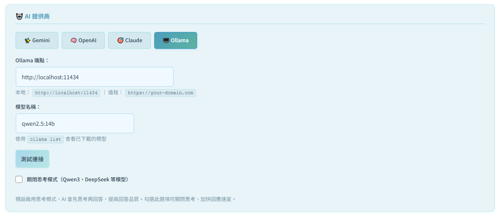
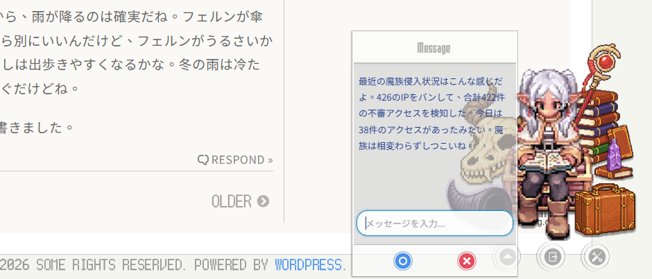

# MP Ukagaka 使用者指南

> 🎭 為你的 WordPress 網站添加可愛的偽春菜

---

## 📑 目錄

### 第一部分：基本設定

1. [簡介](#簡介)
2. [安裝與啟用](#安裝與啟用)
3. [快速開始](#快速開始)
4. [基本設定](#基本設定)
5. [偽春菜管理](#偽春菜管理)
6. [自定義表情系統](#自定義表情系統)

### 第二部分：AI 功能設定

7. [LLM 設定（AI 對話引擎）](#llm-設定ai-對話引擎)
8. [頁面感知功能](#頁面感知功能)
9. [互動對話模式](#互動對話模式)
10. [思考模式](#思考模式)
11. [天氣感知功能](#天氣感知功能)
12. [自動日記功能](#自動日記功能)

### 第三部分：靜態對話功能

13. [外部對話檔案](#外部對話檔案)
14. [會話設定](#會話設定)
15. [特殊代碼](#特殊代碼)
16. [擴展功能](#擴展功能)

17. [常見問題](#常見問題)

---

## 簡介

MP Ukagaka 是一個 WordPress 外掛，讓你在網站上顯示互動式的桌面寵物角色（偽春菜/伺か）。角色可以顯示自訂對話訊息，並支援 AI 頁面感知功能，根據文章內容自動生成評論。

### 主要功能

- 🎨 **多角色支援**：創建並管理多個偽春菜角色
- 💬 **自訂對話**：為每個角色設定專屬對話內容
- 🤖 **通用 LLM 接口**：支援 Ollama、Gemini、OpenAI、Claude 四大 AI 服務
- 🧠 **AI 頁面感知**：根據文章內容自動生成評論
- 🌍 **多語言**：支援繁體中文、日文、英文
- 📁 **外部對話檔案**：支援 TXT 和 JSON 格式的對話檔案
- ⚙️ **高度可自訂**：打字速度、顯示位置、樣式等皆可調整
- 🎭 **自定義提示詞系統**：支援 Markdown 格式的 System Prompt，結構化角色設定

---

# 第一部分：基本設定

> 本部分的設定無論是否使用 AI 功能皆適用。

---

## 安裝與啟用

### 系統需求

- WordPress 5.0 或以上
- PHP 7.4 或以上
- 支援 JavaScript 的現代瀏覽器

### 安裝步驟

1. 下載外掛 ZIP 檔案
2. 登入 WordPress 後台 → **外掛** → **安裝外掛**
3. 點擊「上傳外掛」，選擇下載的 ZIP 檔案
4. 點擊「立即安裝」
5. 安裝完成後，點擊「啟用外掛」

啟用後，前往 **設定** → **MP Ukagaka** 進行設定。

---

## 快速開始

### 5 分鐘快速設定

1. **前往設定頁面**：WordPress 後台 → 設定 → MP Ukagaka
2. **確認預設偽春菜**：在「通用設定」頁面，確認「預設偽春菜」已選擇，勾選「預設顯示偽春菜」和「預設顯示對話框」
3. **儲存設定**：點擊「儲存」按鈕
4. **查看效果**：前往網站前台，應可在頁面右下角看到偽春菜角色

---

## 基本設定

前往 **設定** → **MP Ukagaka** → **通用設定**

### 顯示設定

| 設定項目 | 說明 |
| --- | --- |
| 預設偽春菜 | 選擇預設顯示的角色 |
| 預設顯示偽春菜 | 是否預設顯示角色圖片 |
| 預設顯示對話框 | 是否預設顯示對話框 |

### 對話設定

| 設定項目 | 說明 |
| --- | --- |
| 預設會話 | 「隨機吐槽」或「第一條吐槽」 |
| 會話順序 | 點擊時的下一條對話是「順序」還是「隨機」 |
| 點擊偽春菜 | 點擊角色時的行為（顯示下一條或無操作） |

### 自動對話

| 設定項目 | 說明 |
| --- | --- |
| 啟用自動對話功能 | 是否自動輪換顯示對話 |
| 自動對話間隔時間 | 每次自動換話的間隔（3-30 秒） |
| 打字效果速度 | 對話打字動畫速度（10-200 毫秒/字） |

### 頁面排除

在「不在以下頁面顯示偽春菜」文字框中，輸入不想顯示偽春菜的頁面 URL，每行一條。

支援模糊匹配：在網址尾部加入 `(*)` 可匹配所有子頁面。

```
/admin/
/wp-admin/(*)
/private-page/
```

### 樣式設定

| 設定項目 | 說明 |
| --- | --- |
| 使用自訂樣式 | 勾選後，外掛將不載入內建 CSS，讓你自行控制外觀 |
| 自訂樣式連結 | 可填入 `<link>` 標籤，載入你的自訂 CSS 樣式表 |

> 💡 此選項適合進階使用者。勾選後，你需要在**主題的 CSS** 或透過「自訂樣式連結」欄位載入自己的樣式表。如果沒有要自訂 CSS，請保持未勾選狀態，使用外掛內建樣式即可。

```html
<link rel="stylesheet" href="https://example.com/custom-ukagaka.css" type="text/css" />
```

---

## 偽春菜管理

### 查看現有偽春菜

前往 **設定** → **MP Ukagaka** → **偽春菜們**

在此頁面可以查看所有已建立的偽春菜、編輯名稱/圖片/對話、刪除非預設的偽春菜，以及設定是否顯示。

### 安裝新偽春菜（ZIP 上傳）

MP Ukagaka 支援透過上傳 ZIP 檔案來安裝或更新偽春菜。

#### 準備 ZIP 檔案

ZIP 檔案的根目錄下必須直接包含：

- `manifest.json`：角色設定檔（必需）
- `shell/`：角色圖片資料夾（必需）
- 其他檔案（如 `prompts.json`、`decorations.json` 等）

> ⚠️ 請確保這些檔案和資料夾在 ZIP 根目錄下，而不是包在另一個資料夾中。

#### 上傳步驟

1. 前往 **設定** → **MP Ukagaka** → **偽春菜們**
2. 點擊頁面上方的「**上傳 ZIP**」按鈕
3. 選擇準備好的 ZIP 檔案
4. 等待上傳完成，系統會自動驗證並安裝
5. 安裝完成後，新角色會出現在列表中

### 創建新偽春菜

> 📘 **進階指南**：如需創建包含完整 LLM 支援的角色人格，請參閱 [人格製作指南](GHOST_CREATE_GUIDE.md)。

前往 **設定** → **MP Ukagaka** → **創建新偽春菜**

#### 必填欄位

| 欄位 | 說明 | 範例 |
| --- | --- | --- |
| 名稱 | 偽春菜的名字 | `芙莉蓮` |
| 圖片 | 偽春菜圖片的完整 URL | `https://example.com/ukagaka.png` |
| 吐槽 | 對話內容，每行一條 | 見下方範例 |

```
歡迎來到我的網站！
今天天氣真好呢～
要不要看看最新的文章？
魔法是需要時間慢慢研究的。
```

#### 選填欄位

| 欄位 | 說明 |
| --- | --- |
| 對話檔案名稱 | 外部對話檔案的名稱（不含副檔名） |
| 生成對話檔案 | 勾選後會自動生成對應的對話檔案 |

---

## 自定義表情系統

> 🎭 **v2.4.0 新功能**：讓每個角色擁有自己的表情包。

表情系統根據對話文字中的關鍵字，自動在角色圖片旁顯示對應的表情圖案。**靜態對話和 AI 生成的對話都支援表情功能。**

### 檔案結構

在角色資料夾（`ghost/角色ID/`）中建立以下結構：

- `emojis/`：存放表情圖片（支援 PNG、APNG、GIF）
- `角色ID-emoji.js`：表情控制腳本（可複製 `Frieren-emoji.js` 修改）
- `emoji-keywords.json`：表情觸發關鍵字設定（可選，未建立時使用內建通用映射）

### 設定關鍵字（`emoji-keywords.json`）

```json
{
  "_meta": {
    "description": "角色專屬表情關鍵字",
    "version": "1.0"
  },
  "mappings": {
    "happy": {
      "keywords": ["開心", "高興", "happy", "lol"],
      "file": "happy.png",
      "weight": 10
    },
    "angry": {
      "keywords": ["生氣", "不高興", "angry"],
      "file": "angry.png",
      "weight": 10
    }
  }
}
```

| 欄位 | 說明 |
| --- | --- |
| **keywords** | 觸發此表情的關鍵詞列表 |
| **file** | 對應 `emojis/` 資料夾中的圖片檔名 |
| **weight** | 權重（多個表情匹配時，權重高的優先） |

---

# 第二部分：AI 功能設定

> 本部分需要設定 AI 提供商（或 Ollama 本機服務）才能使用。

---

## LLM 設定（AI 對話引擎）

前往 **設定** → **MP Ukagaka** → **LLM 設定**

LLM（Large Language Model）功能讓偽春菜使用 AI 生成對話，支援四種提供商：

| 提供商 | 費用 | 需要 API Key |
| --- | --- | --- |
| **Ollama**（本機/遠程） | 完全免費 | 不需要 |
| **Google Gemini** | 依用量計費 | 需要（[Google AI Studio](https://makersuite.google.com/app/apikey)） |
| **OpenAI** | 依用量計費 | 需要（[OpenAI Platform](https://platform.openai.com/api-keys)） |
| **Claude (Anthropic)** | 依用量計費 | 需要（[Anthropic Console](https://console.anthropic.com/)） |



### 雲端 AI（Gemini / OpenAI / Claude）

1. 在 **LLM 設定** 頁面選擇對應的提供商
2. 在 **API Key** 欄位輸入你的 API Key（API Key 會自動加密儲存）
3. 從下拉選單選擇模型：
   - **Gemini**：Gemini 2.5 Flash（推薦，速度快成本低）、Gemini 2.5 Pro（適合複雜推理）
   - **OpenAI**：GPT-4.1 Mini（推薦，速度快成本低）、GPT-4o Mini、GPT-4o
   - **Claude**：Claude Sonnet 4.6（推薦）、Claude Haiku 4.5（快速）、Claude Opus 4.7（進階）
4. 點擊「連接測試」確認 API Key 有效

> 💡 **安全提示**：API Key 使用 WordPress `AUTH_KEY` 與 OpenSSL 加密儲存，不會以明文形式儲存在資料庫中。若站台缺少 `AUTH_KEY` 或 OpenSSL 不可用，API Key 將不會被保存。

> 🌍 **多語言支援**：模型選單的說明文字會根據 WordPress 語言設定自動顯示繁體中文、英文或日文。

### Ollama（本機/遠程）

Ollama 是免費的本機 AI，無需 API Key。

**事前準備：**

1. 前往 [Ollama 官網](https://ollama.ai/) 下載並安裝
2. 啟動 Ollama 服務
3. 下載模型，例如在終端機執行：`ollama pull qwen3:8b`

**設定端點：**

- **本機連接**：`http://localhost:11434`
- **遠程連接（Cloudflare Tunnel）**：`https://your-domain.com`

> 💡 外掛會自動偵測連接類型（本機/遠程）並調整超時時間。

**設定模型名稱：**

輸入已下載的模型名稱，例如：

- `qwen3:8b`（推薦，速度與品質平衡）
- `qwen2.5:14b`（更高品質）
- `llama3.2`

> 💡 在終端機使用 `ollama list` 命令查看已下載的模型。

點擊「測試 Ollama 連接」確認連接正常。

#### 使用 Modelfile 創建角色專屬模型（進階）

Ollama 的 Modelfile 可以將角色設定嵌入模型，避免每次傳送 System Prompt，顯著減少 token 消耗並提高回應一致性。

**使用範例 Modelfile：**

本外掛提供了芙莉蓮角色的 Modelfile 範例：`example/frieren_modelfile.example.txt`

```powershell
# 步驟 1：複製範例 Modelfile
Copy-Item wp-content\plugins\mp-ukagaka\example\frieren_modelfile.example.txt $HOME\frieren_modelfile
```

```powershell
# 步驟 2（可選）：修改第一行 FROM 為你已下載的模型
# FROM qwen3:8b
```

```powershell
# 步驟 3：重要！編輯 Modelfile，搜尋並替換以下變數：
# {{admin_nickname}} → 管理人的完整暱稱
# {{admin_name}}     → 管理人的簡稱
# 若不替換，AI 可能在對話中直接說出 {{admin_nickname}}
```

```powershell
# 步驟 4：創建模型
ollama create frieren -f $HOME\frieren_modelfile

# 步驟 5：測試
ollama run frieren "你好"
```

在 **LLM 設定** 頁面，將模型名稱設為 `frieren`（或你創建的模型名稱）。

| 方式 | 優點 | 缺點 |
| --- | --- | --- |
| **Modelfile** | 不消耗 token、回應一致 | 修改需重建模型 |
| **後台設定** | 隨時可改、靈活 | 每次消耗 token |

> 💡 建議：角色設定穩定時使用 Modelfile；還在調試角色時使用後台設定。

**常用 Modelfile 命令：**

```powershell
ollama list                                                      # 查看已建立的模型
ollama rm frieren                                                # 刪除自訂模型
ollama rm frieren; ollama create frieren -f $HOME\frieren_modelfile  # 重新建立
ollama show frieren                                              # 查看模型資訊
```

### 進階設定

#### 使用 LLM 取代內建對話

啟用後，所有偽春菜對話將由 LLM 即時生成，不再使用靜態對話列表。

> 💡 此功能可與「頁面感知」同時啟用。符合頁面感知條件時 AI 評論文章，其他時候則生成隨機對話。

#### 人格設定（System Prompt）

這是角色的核心設定，定義角色個性、說話風格和行為規則。

**支援格式：**

- **純文字格式**（基本）：直接輸入文字描述
- **Markdown 格式**（推薦）：使用標題、列表、強調等，結構清晰易讀
- **XML 標籤格式**（進階）：更精細的控制

**Markdown 格式範例：**

```markdown
## 角色

你是魔法使芙莉蓮。

## 性格

- 說話語氣平靜、略帶冷淡
- 對魔法相關話題比較有興趣
- 時間感覺與人類不同

## 對話規則

- 回應保持在 50 字以內
- 使用常體（不使用敬語）
```

**支援的變數（可在 System Prompt 中使用 `{{變數名}}` 動態替換）：**

| 變數 | 說明 |
| --- | --- |
| `{{ukagaka_display_name}}` | 角色名稱 |
| `{{language}}` | 回應語言（zh-TW、ja、en） |
| `{{time_context}}` | 時間情境（早上、下午、晚上、深夜） |
| `{{admin_nickname}}` | 管理人的完整暱稱 |
| `{{admin_name}}` | 管理人的簡稱 |
| `{{wp_version}}` | WordPress 版本 |
| `{{php_version}}` | PHP 版本 |
| `{{post_count}}` | 文章數 |
| `{{comment_count}}` | 留言數 |
| `{{days_operating}}` | 運營日數 |
| `{{theme_name}}` | 主題名稱 |
| `{{theme_version}}` | 主題版本 |
| `{{theme_author}}` | 主題作者 |

> 💡 **長度建議**：雲端 AI（Gemini、OpenAI、Claude）建議 500-1000 字以內；本機 LLM（Ollama）可使用更長的提示詞（1000+ 字），詳細的提示詞通常能帶來更好的角色一致性。

#### 關閉思考模式（Qwen3、DeepSeek 等模型）

啟用後會關閉 Qwen3、DeepSeek 等模型的思考行為，提高回應效率、減少等待時間。使用這類模型時建議啟用。

### Ollama 遠程連接（Cloudflare Tunnel）

```bash
# Windows
cloudflared.exe service install <token>

# Linux/Mac
cloudflared service install <token>
```

確認隧道 URL 後，在端點欄位填入 `https://your-domain.com`。也支援 ngrok 等其他 HTTP/HTTPS 隧道服務。

---

## 頁面感知功能

前往 **設定** → **MP Ukagaka** → **AI 設定**

頁面感知功能讓偽春菜在特定頁面自動生成與文章內容相關的 AI 評論。**需先在 LLM 設定頁面完成 AI 提供商設定。**

### 設定項目

#### 語言設定

選擇 AI 回應語言：繁體中文 / 日文 / 英文

#### 角色設定（System Prompt）

頁面感知使用的角色個性設定。格式與變數支援同 [人格設定](#人格設定system-prompt)。

#### 頁面感知機率（%）

設定在符合條件頁面觸發 AI 評論的機率（1-100%）。

| 建議值 | 效果 |
| --- | --- |
| 10-30% | 較自然，不會過於頻繁 |
| 50% | 平衡的觸發頻率 |
| 80-100% | 幾乎每次都觸發 |

#### 觸發頁面

設定在哪些頁面類型觸發 AI 評論，多個條件用逗號分隔：

| 標籤 | 說明 |
| --- | --- |
| `is_single` | 單篇文章 |
| `is_page` | 靜態頁面 |
| `is_home` | 首頁 |
| `is_front_page` | 靜態首頁 |
| `is_archive` | 所有歸檔頁面 |
| `is_category` | 分類頁面 |
| `is_tag` | 標籤頁面 |

範例：`is_single,is_page`

#### AI 對話顯示時間（秒）

AI 生成的評論自動消失前的顯示時間。

| 建議值 | 適用情境 |
| --- | --- |
| 5-10 秒 | 較短評論，不干擾閱讀 |
| 10-15 秒 | 平衡 |
| 15-20 秒 | 較長評論 |

#### 啟用首次訪客問候

啟用後，首次訪問網站的訪客會收到特別的問候訊息。

#### 首次訪客問候提示詞

設定首次訪客的問候提示詞，與角色設定結合生成個性化問候。支援與 System Prompt 相同的 `{{變數名}}` 替換。

範例：

```
向首次訪問的訪客打招呼，簡單介紹一下這個網站。
```

#### 機器人偵測（Bot Detection）

系統自動偵測爬蟲機器人。當偵測到 Bot 訪問時，可觸發特定對話反應（如「發現侵入者」）。


### 工作流程

1. 訪客訪問符合「觸發頁面」條件的頁面
2. 系統根據「頁面感知機率」決定是否觸發
3. 觸發時：讀取文章內容 → 結合角色設定 → 呼叫 AI 服務生成評論 → 顯示在對話框中 → 依「AI 對話顯示時間」自動消失

### 與 LLM 設定的關係

- **LLM 設定頁面**：控制使用哪個 AI 服務（提供商、API Key、模型）
- **AI 設定頁面（頁面感知）**：控制何時觸發、如何顯示

兩者可同時啟用：符合頁面感知條件時 AI 評論文章；其他時候使用 LLM 生成隨機對話。

---

## 互動對話模式

> 🎉 **v2.3.0 新功能**：讓訪客與偽春菜進行即時多輪對話。

### 什麼是互動對話模式？

互動對話模式將前台的「更換偽春菜」按鈕改造為即時對話介面，訪客可以主動與角色進行多輪對話。這不同於頁面感知（自動評論文章），互動對話完全由訪客主動觸發。

**需先在 LLM 設定完成 AI 設定才能使用。**

### 如何啟用

1. 前往 **設定 → MP Ukagaka → 通用設定**
2. 在「💬 對話設定」區塊勾選「**啟用互動對話功能**」
3. 點擊「儲存」
4. 前台的「更換偽春菜」按鈕將變為「💬 對話」按鈕

### 使用方式

1. 點擊右下角「💬 對話」按鈕
2. 對話框展開，顯示歡迎訊息
3. 在底部輸入框輸入訊息，按 Enter 或點擊發送圖示
4. AI 根據輸入生成回應
5. 可繼續對話，系統記住之前的內容

對話歷史保留在當前頁面（重新整理後清空）。


### 斜線指令

| 指令 | 適用對象 | 說明 |
| --- | --- | --- |
| `/help` | 所有人 | 顯示可用指令清單 |
| `/reset` | 僅管理員 | 清除當前對話歷史 |
| `/clear` | 僅管理員 | 與 `/reset` 相同 |
| `/remember` | 僅管理員 | 提取近期對話事實，並儲存為角色的記憶 |
| `/debug_mcp` | 僅管理員 | 顯示 MCP/Abilities 診斷報告 |

> 管理員指令依 WordPress 登入狀態判定。非登入使用者輸入這些指令時，角色會以角色口吻拒絕。

### 對話模式 vs 頁面感知

| 功能 | 互動對話模式 | 頁面感知模式 |
| --- | --- | --- |
| **觸發方式** | 訪客主動點擊 | 自動觸發（依機率） |
| **互動性** | 雙向多輪對話 | 單向評論 |
| **上下文** | 維持完整對話歷史 | 僅分析當前頁面 |
| **Token 消耗** | 每輪累積 | 單次評論 |
| **啟用位置** | 通用設定 → 對話設定 | AI 設定 → 頁面感知 |

### Abilities（能力系統）

> 🛠️ **v2.8.0 新功能**：讓角色能夠執行網站管理任務。

Abilities 是角色在對話中可以自動呼叫的伺服器端功能。管理員只需在對話模式中用自然語言提出要求，角色就會執行對應的後台工具並回報結果。不需要特殊指令 — 正常對話即可。



_「最近魔族の侵入状況を教えて」— 芙莉蓮以角色口吻回報 Bot Blocker 的統計數據_

> ⚠️ 管理類 Ability（IP 封鎖、資料清除等）僅限以 WordPress 管理員身分登入時才能使用。一般訪客請求這些操作時，角色會以角色口吻拒絕。

#### 使用範例

在對話模式中直接跟角色說即可：

| 想做的事 | 對話範例 |
| --- | --- |
| 查看人氣文章 | 「最近最多人看的文章是哪些？」 |
| 封鎖 IP | 「幫我 BAN 掉 192.168.1.100」 |
| 查看 Bot 統計 | 「最近的機器人攔截狀況怎樣？」 |
| 清除日誌 | 「把 Bot Blocker 的日誌清一下」 |
| 偵測 AI 爬蟲 | 「最近有 AI 爬蟲來過嗎？」 |
| 訪客脈動 | 「最近一小時的流量如何？」 |

#### 內建 Abilities 一覽

| Ability | 說明 | 需要的外掛 |
| --- | --- | --- |
| **取得人氣文章** | 依瀏覽數排名文章（最多 10 篇，可指定日期範圍） | [WP-PostViews](https://wordpress.org/plugins/wp-postviews/) |
| **Bot Blocker 統計** | 顯示已封鎖 IP 數量、依類型分類的攔截統計 | Moelog Bot Blocker |
| **封鎖 IP 位址** | 手動將指定 IP 加入封鎖清單 | Moelog Bot Blocker |
| **清除 Blocker 資料** | 清除攔截日誌或重設 IP 封鎖清單 | Moelog Bot Blocker |
| **AI 爬蟲偵測** | 偵測最近來訪的 AI 訓練爬蟲（GPTBot、ClaudeBot、Bytespider 等） | [Slimstat Analytics](https://wordpress.org/plugins/wp-slimstat/) |
| **訪客脈動** | 顯示近期請求數、不重複 IP、國家分布、Bot/人類比例 | [Slimstat Analytics](https://wordpress.org/plugins/wp-slimstat/) |

> 💡 未安裝所需外掛的 Ability 會自動跳過。在對話模式中使用 `/debug_mcp` 指令，可查看目前可用的 Abilities 清單。

> 📚 開發者文件（如何建立自訂 Ability 等）請參閱 [Abilities API 參考](ABILITIES_API.md)。

---

## 思考模式

> 🧠 **v2.3.0 新功能**：讓 Ollama 模型先思考再回答，提升回應品質。

### 什麼是思考模式？

思考模式讓支援的 AI 模型（如 Qwen3、DeepSeek）在回答前先進行內部推理。思考過程不會顯示給訪客，只顯示最終回覆。

> 💡 Gemini、OpenAI、Claude 等雲端服務不需要此設定，思考過程已在服務端內部處理。

### 預設行為（v2.3.0 起）

思考模式**預設啟用**（`think = true`）。AI 先思考再回答，確保輸出品質。

**支援的 Ollama 模型：**

- **Qwen3** 系列：`qwen3:8b`、`qwen3:14b` 等
- **DeepSeek** 系列：`deepseek`、`deepseek-r1` 等

### 如何停用

若需要更快的回應速度（犧牲部分準確度）：

1. 前往 **設定 → MP Ukagaka → LLM 設定**
2. 在「Ollama 設定」中勾選「**關閉思考模式（Qwen3、DeepSeek 等模型）**」
3. 點擊「儲存」

| 特性 | 思考模式（預設） | 非思考模式 |
| --- | --- | --- |
| **回應品質** | 高準確度 | 較快但可能不準 |
| **回應速度** | 稍慢（+1-2 秒） | 較快 |
| **Context Window（對話模式）** | 8192 tokens | 4096 tokens |
| **思考與回覆** | 完全分離 | 可能混在一起 |

---

## 天氣感知功能

> 🌤️ **v2.5.0 新功能**：讓偽春菜也能感知天氣！

使用 [Open-Meteo](https://open-meteo.com/) 免費 API，**無需申請 API Key**。啟用後，角色會知道當地天氣狀況，並在對話或評論中提及（需配合支援天氣變數的 System Prompt）。

### 設定步驟

1. 在 **LLM 設定** 頁面勾選「**啟用天氣感知功能**」
2. 輸入所在地的經緯度（預設為台北：25.0330, 121.5654）
   - 可在 [Google Maps](https://www.google.com/maps) 上右鍵點擊地圖複製座標
3. 點擊「測試天氣 API」確認可以成功取得天氣資訊

### 功能特色

- 即時取得當前溫度與天氣狀況（晴、雨、陰等）
- 明日天氣預報
- 今日及明日降水機率
- 自動快取，避免頻繁請求

---

## 自動日記功能

> 📓 **v2.5.0 新功能**：讓角色自動生活、自動寫日記。

前往 **設定** → **MP Ukagaka** → **日記設定**

### 什麼是自動日記功能？

啟用後，角色會以極低的機率（由你設定）自動撰寫並發表日記文章，包含：

- 今天的日期和季節
- 當地天氣狀況（如已啟用天氣功能）
- 符合角色設定的心情和想法
- 隨機的生活點滴

### 基本設定

| 設定項目 | 說明 |
| --- | --- |
| 啟用自動日記功能 | 開啟後系統每天檢查一次是否觸發 |
| 發文分類 | 選擇日記發表到哪個 WordPress 分類 |
| 發文作者 | 選擇以哪個 WordPress 使用者身分發表 |
| 觸發機率 | 每天觸發的機率（1%-10%） |
| 文章簽名 | 附加在每篇日記末尾的文字（可留空） |

**觸發機率參考：**

| 機率 | 約每月篇數 |
| --- | --- |
| 2% | 0~1 篇（稀有） |
| 5% | 1~2 篇（偶爾） |
| 10% | 3 篇（頻繁） |

> ⚠️ 為了不讓日記洗版，建議保持在 2-5% 左右。

> 💡 建議先在 WordPress 文章分類中建立一個專屬分類（如「フリーレン手記」），再在此選擇。

### 日記 AI 提供商

日記功能使用**獨立的 AI 設定**，可以與一般對話功能使用不同的提供商。例如：對話用 Ollama（免費），日記用 Gemini 2.5 Flash（高品質且便宜）。

支援的提供商與 LLM 設定相同：Gemini、OpenAI、Claude、Ollama。

### 日記主題設定（diary.json）

日記「寫什麼」由角色資料夾中的 `diary.json` 控制，定義日記的主題類別、提示詞和出現機率（weight）。

**檔案位置：** `ghost/角色ID/diary.json`

詳細格式說明請參閱 [人格製作指南](GHOST_CREATE_GUIDE.md)。

### 測試功能

在設定頁面下方點擊「**立即生成一篇日記（測試）**」，可立即確認 AI 連線、發文設定和內容風格是否符合預期。

---

# 第三部分：靜態對話功能

> 本部分說明不使用 AI 模型時，偽春菜支援的對話功能。

---

## 外部對話檔案

偽春菜可以從外部檔案載入對話，支援 TXT 和 JSON 兩種格式。

**啟用方式：** 在 **通用設定** 中勾選「使用外部對話文件」，並選擇格式（TXT 或 JSON）。

### TXT 格式

**檔案位置：** `wp-content/plugins/mp-ukagaka/dialogs/角色名.txt`

```
第一條對話

第二條對話

第三條對話
```

> ⚠️ 每條對話之間用**空行**分隔。

### JSON 格式

**檔案位置：** `wp-content/plugins/mp-ukagaka/dialogs/角色名.json`

```json
{
  "messages": ["第一條對話", "第二條對話", "第三條對話"]
}
```

---

## 會話設定

前往 **設定** → **MP Ukagaka** → **會話**

### 固定資訊

此訊息會**附加在每條對話的後面**，適合用來顯示網站公告或添加簽名。

```
—— 歡迎訂閱本站 RSS
```

### 通用對話

填寫後，**所有偽春菜都會使用這些對話**，取代各自的自訂對話。清空此欄則恢復各偽春菜的預設對話。

---

## 特殊代碼

在對話文字中可以使用特殊代碼顯示動態內容：

| 代碼 | 說明 |
| --- | --- |
| `:recentpost[N]:` | 顯示最近 N 篇文章列表 |
| `:randompost[N]:` | 顯示隨機 N 篇文章 |
| `:commenters[N]:` | 顯示最近 N 位留言者 |

**範例：**

```
最近的文章：:recentpost[3]:
```

---

## 擴展功能

前往 **設定** → **MP Ukagaka** → **擴展**

### JS 區

可添加自訂 JavaScript 代碼，為偽春菜添加更多互動功能。

**範例：雙擊偽春菜跳轉到指定頁面**

```javascript
document.getElementById('cur_ukagaka').addEventListener('dblclick', function() {
  window.location.href = '/about/';
});
```

---

# 常見問題

### 偽春菜沒有顯示

1. 確認「預設顯示偽春菜」已勾選
2. 檢查當前頁面是否在排除列表中
3. 清除瀏覽器快取
4. 按 F12 查看 Console 是否有 JavaScript 錯誤

### AI 沒有觸發

1. 確認已啟用「頁面感知功能」
2. 檢查 API Key 是否正確
3. 確認當前頁面符合觸發條件
4. 將「頁面感知機率」暫時設為 100% 測試
5. 確認文章內容超過 500 字

### 對話顯示不正確

1. 確認對話檔案格式正確
2. TXT 格式：每條對話用**空行**分隔
3. JSON 格式：確認是有效的 JSON

### AI 回應太慢

1. 切換到更快的模型（如 `gemini-2.5-flash`、`qwen3:8b`）
2. **雲端 AI**：縮短 System Prompt 可減少 API 處理時間
3. **本機 LLM（Ollama）**：Prompt 長度對速度影響較小，可考慮調整模型大小或硬體
4. 確認網路連線正常

### LLM 連接失敗

**Ollama：**

1. 確認 Ollama 服務正在運行
2. 確認端口為 11434，嘗試在瀏覽器訪問 `http://localhost:11434`
3. 遠程連接：確認 Cloudflare Tunnel 服務正在運行並確認隧道 URL 正確

**Gemini / OpenAI / Claude：**

1. 確認 API Key 正確且未過期
2. 確認 API Key 有足夠額度
3. 確認網路連線正常，檢查防火牆是否阻擋 API 請求

### 如何控制 AI 成本

1. 降低「頁面感知機率」（建議 10-20%）
2. 限制「觸發頁面」（只在 `is_single` 觸發）
3. 使用較便宜的模型（如 `gemini-2.5-flash`、`gpt-4o-mini`）
4. 使用 Ollama（本機運行，完全免費）

---

## 技術支援

如有問題，請：

1. 查閱本使用者指南
2. 訪問 [萌えログ.COM](https://www.moelog.com/)

---

**Made with ❤ for WordPress**
