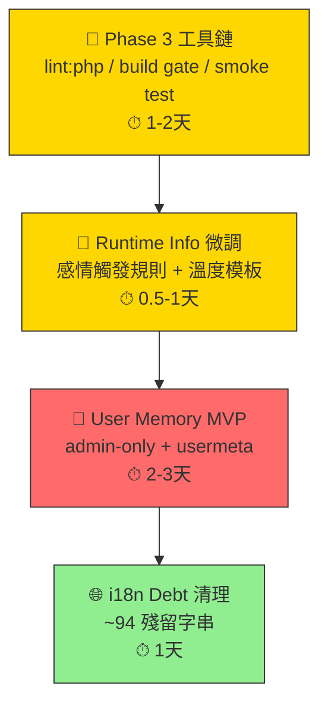

# MP-Ukagaka 剩餘可執行項目分析

> 📅 分析日期：2026-05-13
> 📋 基於 `plan/` 目錄與 `CHANGELOG.md` 交叉比對

---

## 總覽

截至 v2.15.0（2026-05-08），plugin 已完成大量工作。以下按 **優先度** 與 **投資報酬率** 分類剩餘項目。

---

## 🔴 高價值 — 功能性提升

### 1. User Memory 使用者記憶（§1 of Future_Plan）

| 項目 | 說明 |
|------|------|
| **狀態** | ❌ 未開始 |
| **工數** | MVP 2-3 天 / 完整版 5-8 天 |
| **效果** | ⭐⭐⭐⭐⭐ — 從「每次對話都是陌生人」進化到「記得你的角色」 |
| **前置條件** | §4 模組化已完成 ✅ |

**MVP 範圍（推薦先做）：**
- admin-only + `usermeta` 儲存（匿名訪客不在範圍內）
- 對話結束時用輕量 LLM prompt 抽取記憶（**需設計前端觸發點與新 REST endpoint**；每次對話後呼叫 LLM 會增加延遲與成本，應節流或改為手動觸發）
- 記憶上限 500 字 / 最多 10 條事實；舊記憶覆寫而非無限累加，避免髒資料
- 後台可清除（無需完整編輯 UI）
- 注入 `mpu_resolve_system_prompt()`（`personality-loader.php:392`）的記憶注入點

> [!WARNING]
> **工數 2-3 天僅適用於以上「最窄 MVP」範圍**（admin-only、手動/低頻萃取、簡單 usermeta JSON、後台可清除，無編輯 UI、無多人識別、無訪客記憶）。若加入自動萃取、編輯 UI、多人或訪客識別、隱私設定，工數應估 5-8 天。

> [!TIP]
> 這是 Future_Plan 中 **效果最高、前置條件已滿足** 的項目。§4（模組化）已完成，`mpu_resolve_system_prompt()` 已是所有 handler 的集中注入點；真正的設計工作在「記憶萃取時機」與「記憶生命週期（去重/覆寫/清除）」，而非 prompt 注入本身。

---

## 🟡 中價值 — 工程品質 / DX 改善

### 2. Phase 3 工具鏈安全網（Code_Quality_Hardening_Plan）

| 項目 | 狀態 | 工數 | 說明 |
|------|:----:|------|------|
| `npm run lint:php` 補強掃描範圍 | ✅ | 0.25 天 | 已補掃 `mp-ukagaka.php`（`package.json:12`），62 個 PHP 檔全數通過 |
| `npm run verify`（lint:php + build 整合） | ✅ | 0.25 天 | 已新增，依序執行 lint:php → build |
| REST smoke test checklist | ✅ | 0.5 天 | `docs-en/REST_SMOKE_TEST.md`，6 組共 12 項，含 curl 命令與發版前 checklist |
| PHPCS baseline | ❌ | 0.5-1 天 | 設 baseline 避免既有風格一次爆量；**不需在 User Memory MVP 之前完成** |

> [!IMPORTANT]
> Code_Quality_Hardening_Plan 的結論明確指出：**下次動 PHP 前，應先建立工具鏈安全網**。這是做後續結構拆分的前置。

### 3. Runtime Info 微調（§2 of Future_Plan）

| 項目 | 狀態 | 工數 |
|------|:----:|------|
| `instructions.md` 加入明確感情觸發規則 | ✅ | 0.5 天（純 prompt engineering） |
| 溫度閾值擴充（≥28°C / ≤15°C，與 personality.md 對齊） | ✅ | 0.5 天（改 `personality-prompts.php:438/446`） |

### 4. Pre-existing i18n Debt

| 項目 | 狀態 | 工數 |
|------|:----:|------|
| 約 94 條殘留非日語字串 | ✅ | 1 天 |

> v2.13.2 做了約 200+ 字串的日語統一，v2.16 i18n Debt pass 補充了 172 條 zh-TW 翻譯（日文 msgid → 中文）及 10 條 ja 翻譯（中文 msgid → 日文）。剩餘未翻譯條目均為 MCP abilities 英文工具描述（設計上刻意保持英文）或中文 msgid（zh-TW 用戶直接顯示正確）。

---

## 🟢 低優先度 — 結構性重構（Nice-to-have）

### 5. Chat Controller 進階拆分（Code_Quality_Hardening_Plan Phase 2）

| 項目 | 狀態 | 說明 |
|------|:----:|------|
| Request normalizer 拆分 | ❌ | 只有在大改 chat 流程時才值得做 |
| Prompt builder 拆分 | ❌ | 同上 |

### 6. Utility Functions 領域拆分（Code_Quality_Hardening_Plan Phase 2）

| 項目 | 狀態 | 說明 |
|------|:----:|------|
| `utility-functions.php` 拆成 5 個領域檔案 | ❌ | Plan 自註「Phase 2 中風險最高」，需先有 lint gate |

### 7. Chain of Thought 實驗（§3 of Future_Plan）

| 項目 | 狀態 | 說明 |
|------|:----:|------|
| Gemini thinking mode A/B test | ❌ | 效果不確定，token 成本 3-5 倍，低優先 |

---

## 📊 推薦執行順序

| 順序 | 項目 | 理由 |
|:----:|------|------|
| 1 | 工具鏈安全網 | ROI 最高的下一步；lint:php 已有但需補強掃描範圍，再串 verify 腳本與 REST smoke |
| 2 | Runtime Info 微調 | 純 prompt/JSON 修改，零風險，可立即改善角色表現；不是 Memory 的前置條件，可與 #1 並行 |
| 3 | **User Memory MVP** | **最大功能性提升**，前置條件已滿足；開始前先確認萃取觸發機制與記憶生命週期設計 |
| 4 | i18n Debt | 下次發版前清理即可；除非 Memory 新增大量 UI 字串，否則不影響開發 |
| 5+ | 結構拆分、CoT 實驗 | 按需求驅動，不主動排期 |

---

## ⏸ 已完成（無需再做）

| 計畫項目 | 完成版本 |
|----------|----------|
| §4 模組化（personality.md + instructions.md） | v2.8.1 |
| §2 Runtime Info（90%+） | v2.5.2 ~ v2.14.1 |
| Phase 1 Security Hardening | v2.15.0 |
| Phase 2 Structural（History Service + Admin Save） | v2.15.0 |
| Dead Code Cleanup + Docs | v2.13.0 + v2.13.9 |
| Dead_Code_Cleanup_DocsTodo | v2.13.9 docs updated |
| SSE Streaming 全 provider | v2.14.0 |
| Developer Docs 三語同步 | v2.13.6 |
| USER_GUIDE 重構 | v2.13.5 |
